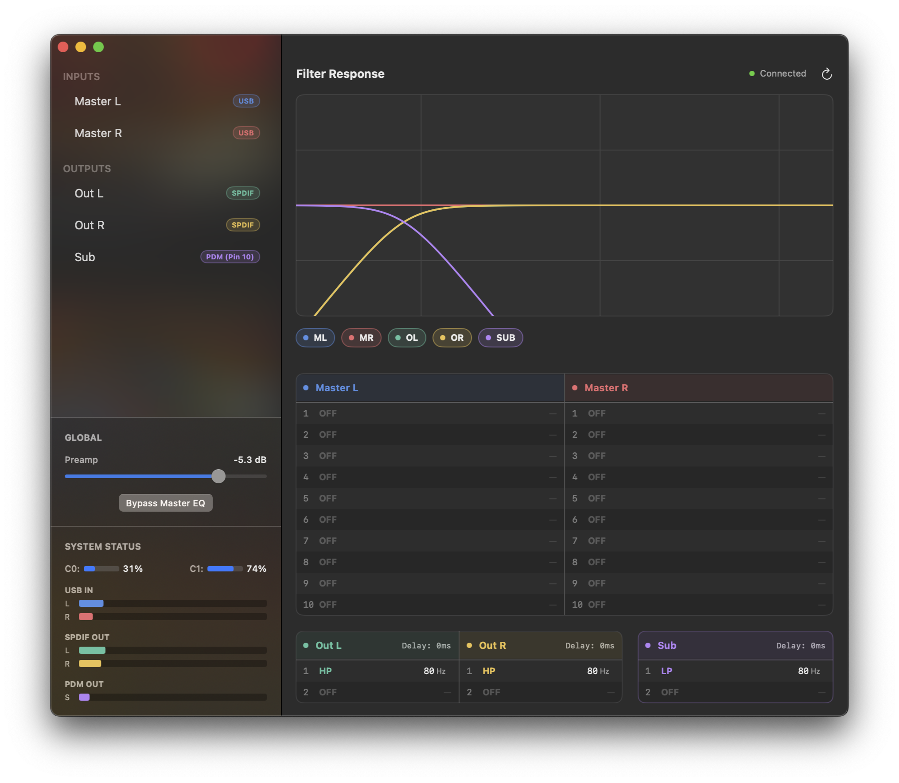

# DSPi Console

**DSPi Console** is the native macOS companion application for the [DSPi firmware](https://github.com/WeebLabs/DSPi). It provides comprehensive real-time control, monitoring, and headphone correction for the DSPi audio platform.

## Features

### Real-Time Control
* **Parametric EQ**: 
    * **Master Inputs (USB)**: 10 parametric bands per channel.
    * **Outputs (SPDIF & Sub)**: 2 parametric bands per channel for crossover/correction.
* **Filter Types**: Peaking, Low Shelf, High Shelf, Low Pass, and High Pass.
* **Time Alignment**: Adjustable delay (0–170ms) for each output channel to align speakers and subwoofers.
* **Global Preamp**: Digital gain control (-60dB to +10dB) and a master channel PEQ bypass toggle.

### AutoEQ Integration
Support for the [AutoEQ](https://github.com/jaakkopasanen/AutoEq) project, providing immediate access to all headphone calibration profiles with a local database.
* **One-Click Apply**: Instantly maps correction curves to the Master PEQ bands and sets preamp.
* **Favorites**: Keeps your most frequently used headphone profiles readily accessible.
* **Updater**: Fetches an updated copy of the AutoEQ database when necessary.

### Hardware Monitoring
* **Live Metering**: Real-time peak level indicators for:
    * USB Inputs (Left/Right)
    * SPDIF Outputs (Left/Right)
    * PDM Subwoofer Output
* **System Status**: Monitors the load of both RP2040 cores in real-time.
* **Hotplug**: Automatic device detection and reconnection.

### Visualization
* **Response Graph**: High-fidelity Bode plot rendering of the active filter chain.
* **Math Engine**: Swift port of the DSPi firmware's biquad logic ensures the graph exactly matches hardware behavior.
* **Dashboard View**: A high-level overview of all active channels and their configurations.

## Technical Architecture

### Control Protocol
The application communicates with the RP2040 via raw USB bulk transfers using `IOUSBDeviceInterface`.

**Device Identification:**
* **Vendor ID**: `0x2e8a`
* **Product ID**: `0xfedd`

| Request | ID | Payload | Description |
| :--- | :--- | :--- | :--- |
| `REQ_SET_EQ_PARAM` | `0x42` | `struct { ch, band, type, freq, q, gain }` | Uploads filter parameters. |
| `REQ_GET_EQ_PARAM` | `0x43` | `(float32)` | Retrieves current filter values. |
| `REQ_SET_PREAMP` | `0x44` | `(float32)` | Sets global input gain in dB. |
| `REQ_GET_PREAMP` | `0x45` | `(float32)` | Retrieves current preamp gain. |
| `REQ_SET_BYPASS` | `0x46` | `(uint8)` | Enables/Disables master hardware bypass. |
| `REQ_GET_BYPASS` | `0x47` | `(uint8)` | Retrieves bypass state. |
| `REQ_SET_DELAY` | `0x48` | `(float32)` | Sets channel delay in milliseconds. |
| `REQ_GET_DELAY` | `0x49` | `(float32)` | Retrieves channel delay. |
| `REQ_GET_STATUS` | `0x50` | `struct { peaks[5], cpu[2] }` | Polls meters and CPU usage. |
| `REQ_SAVE_PARAMS` | `0x51` | `(none)` | Persists current configuration to flash. |
| `REQ_LOAD_PARAMS` | `0x52` | `(none)` | Reloads configuration from flash. |
| `REQ_FACTORY_RESET` | `0x53` | `(none)` | Resets all settings to default. |

### Channel Mapping
The application manages five audio channels:

| Channel | Role | Band Count |
| :--- | :--- | :--- |
| **Master L/R** | USB Input | 10 per channel |
| **Out L/R** | SPDIF Output | 2 per channel |
| **Sub** | PDM Output (Pin 10) | 2 |

## Building the Project

1.  Clone the repository.
2.  Open `DSPi Console.xcodeproj` in Xcode 15+.
3.  Ensure the deployment target matches your macOS version (macOS 12.0+ recommended).
4.  Run the **DSPi Console** scheme.
5.  The app will automatically connect when a compatible DSPi device is detected.
