# DSPi Console

**DSPi Console** is the macOS app for setting up and controlling a [DSPi](https://github.com/WeebLabs/DSPi) audio processor. DSPi turns a Raspberry Pi Pico (RP2040) or Pico 2 (RP2350) into a USB sound card with a full digital signal processor inside it. Console is where you shape that processing. You can draw EQ curves directly on a response graph, route any input to any output, align speakers in time, add effects such as loudness compensation and headphone crossfeed, wire up physical knobs and remotes, and keep everything in presets stored on the device.

This README is the user guide for Console. It explains every part of the app and how to operate it. For the firmware itself, wiring diagrams and the USB protocol, see the [DSPi firmware repository](https://github.com/WeebLabs/DSPi).

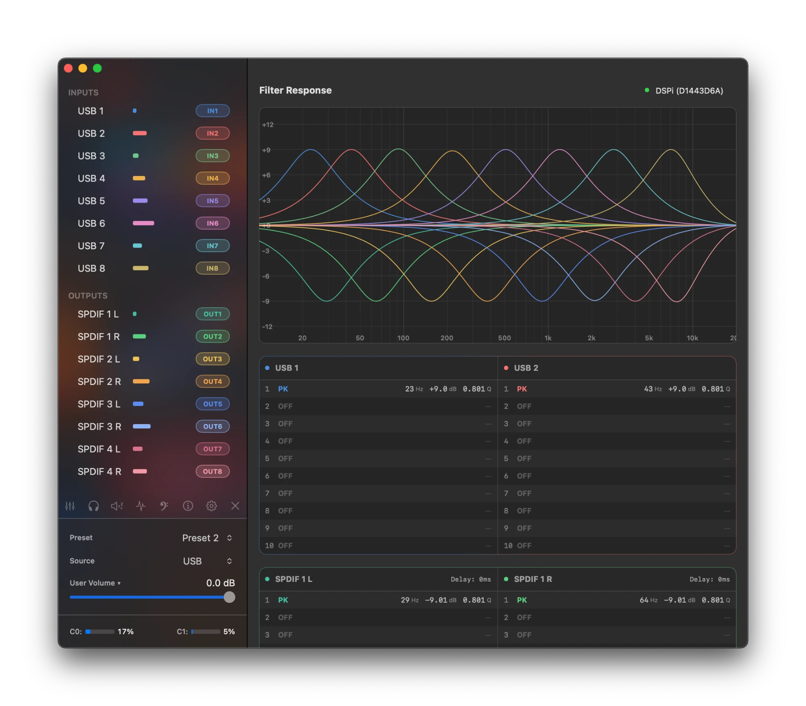

## Contents

- [Requirements](#requirements)
- [Getting Started](#getting-started)
  - [The Getting Started Wizard](#the-getting-started-wizard)
  - [Connecting a Device](#connecting-a-device)
  - [Firmware Version Warning](#firmware-version-warning)
  - [How Changes Are Stored](#how-changes-are-stored)
- [The Main Window](#the-main-window)
  - [Window Layout](#window-layout)
  - [Channel List](#channel-list)
  - [Quick-Access Buttons](#quick-access-buttons)
  - [Preset Picker](#preset-picker)
  - [Input Source Picker](#input-source-picker)
  - [Volume Controls](#volume-controls)
  - [CPU Meters](#cpu-meters)
  - [Dashboard](#dashboard)
- [Channel Pages](#channel-pages)
  - [Input Channel Pages](#input-channel-pages)
  - [Output Channel Pages](#output-channel-pages)
  - [Output Limiter](#output-limiter)
  - [The Band List](#the-band-list)
  - [Filter Types](#filter-types)
  - [Crossover Bands](#crossover-bands)
  - [Linkwitz Transform](#linkwitz-transform)
  - [Copying Channel Settings](#copying-channel-settings)
  - [Value Fields and Sliders](#value-fields-and-sliders)
- [The Response Graph](#the-response-graph)
  - [Reading the Graph](#reading-the-graph)
  - [Graph Options](#graph-options)
  - [Graph Setup](#graph-setup)
  - [Resizing the Graph](#resizing-the-graph)
  - [Pop-Out Graph Window](#pop-out-graph-window)
  - [Spectrum Display](#spectrum-display)
- [On-Graph Filter Editing](#on-graph-filter-editing)
  - [When Editing Is Available](#when-editing-is-available)
  - [Hovering](#hovering)
  - [Adding Bands](#adding-bands)
  - [Selecting Bands](#selecting-bands)
  - [Dragging Bands](#dragging-bands)
  - [Scroll Wheel and Trackpad](#scroll-wheel-and-trackpad)
  - [The Band Chip](#the-band-chip)
  - [Changing Shape and Slope](#changing-shape-and-slope)
  - [Right-Click Menus](#right-click-menus)
  - [Keyboard Shortcuts on the Graph](#keyboard-shortcuts-on-the-graph)
  - [Graph Editing Quick Reference](#graph-editing-quick-reference)
  - [Editing Limits](#editing-limits)
- [Presets and Saving](#presets-and-saving)
  - [What Gets Saved Where](#what-gets-saved-where)
  - [Working with Preset Slots](#working-with-preset-slots)
  - [The Preset Menu](#the-preset-menu)
  - [Unsaved Changes](#unsaved-changes)
  - [Commit, Revert and Factory Reset](#commit-revert-and-factory-reset)
  - [Saving Master Volume and Output Configuration](#saving-master-volume-and-output-configuration)
- [Importing and Exporting](#importing-and-exporting)
  - [Filter Files](#filter-files)
  - [Device Configuration Files](#device-configuration-files)
- [AutoEQ Headphone Profiles](#autoeq-headphone-profiles)
  - [Browsing and Applying Profiles](#browsing-and-applying-profiles)
  - [Favourites](#favourites)
  - [Updating the Database](#updating-the-database)
- [Tool Windows](#tool-windows)
  - [Common Tool Controls](#common-tool-controls)
  - [Matrix Mixer](#matrix-mixer)
  - [Loudness Compensation](#loudness-compensation)
  - [Headphone Crossfeed](#headphone-crossfeed)
  - [Volume Leveller](#volume-leveller)
  - [Psychoacoustic Bass](#psychoacoustic-bass)
  - [Subharmonic Synthesizer](#subharmonic-synthesizer)
  - [Tube Modeller](#tube-modeller)
  - [Stereo Upmixer](#stereo-upmixer)
  - [Signal Generator](#signal-generator)
  - [Spectrum Analyser](#spectrum-analyser)
  - [System Statistics](#system-statistics)
  - [Interrupt Monitor](#interrupt-monitor)
- [Settings](#settings)
  - [Opening and Navigating Settings](#opening-and-navigating-settings)
  - [The Settings Save Bar](#the-settings-save-bar)
  - [About](#about)
  - [Advanced](#advanced)
  - [Graphing](#graphing)
  - [Spectrum Analyser Settings](#spectrum-analyser-settings)
  - [Pin Overview](#pin-overview)
  - [Inputs](#inputs)
  - [Outputs](#outputs)
  - [I2S Configuration](#i2s-configuration)
  - [Global Parameters](#global-parameters)
  - [Control Interfaces](#control-interfaces)
- [Control Surfaces](#control-surfaces)
  - [How Control Surfaces Work](#how-control-surfaces-work)
  - [Adding and Managing Controls](#adding-and-managing-controls)
  - [Component Types and Wiring](#component-types-and-wiring)
  - [Choosing What a Control Does](#choosing-what-a-control-does)
  - [Actions and Values](#actions-and-values)
  - [Options and Wiring Sense](#options-and-wiring-sense)
  - [LED Delays and Brightness](#led-delays-and-brightness)
  - [IR Remote](#ir-remote)
  - [Display](#display)
  - [Channel Groups](#channel-groups)
  - [Macros](#macros)
  - [Auxiliary Outputs](#auxiliary-outputs)
  - [Control Surface Messages](#control-surface-messages)
- [Firmware Updates](#firmware-updates)
  - [Updating from the Console](#updating-from-the-console)
  - [Bootloader Mode](#bootloader-mode)
  - [Firmware Update Messages](#firmware-update-messages)
- [Help Menu](#help-menu)
- [Keyboard Shortcut Reference](#keyboard-shortcut-reference)
- [Building from Source](#building-from-source)
- [License](#license)

---

## Requirements

- A Mac running macOS 14.6 or later. On-graph filter editing draws with Metal, which every supported Mac provides.
- A DSPi board: a Raspberry Pi Pico (RP2040) or Pico 2 (RP2350) running DSPi firmware. Console installs the firmware for you, so a blank board is fine (see [The Getting Started Wizard](#the-getting-started-wizard)).
- A USB cable that carries data, not just power.

Console and the firmware are released as a matched pair with the same version number. Each Console build carries the firmware it was made for and offers to install it when the board runs anything else (see [Firmware Version Warning](#firmware-version-warning)).

Some features exist only on the RP2350, because they need its extra processing power and pins. This guide says so wherever that applies. Most windows also check what the connected firmware supports. If a feature is missing from your firmware, its window or control tells you so instead of failing silently.

---

## Getting Started

### The Getting Started Wizard

The first time you open Console, the main window shows the **Getting Started** wizard instead of the console. It takes you through three steps: **Welcome**, **Board** and **Done**. You can reopen it at any time from **Help > Getting Started...**. While the wizard is on screen, the File, AutoEQ and Tools menus are unavailable.

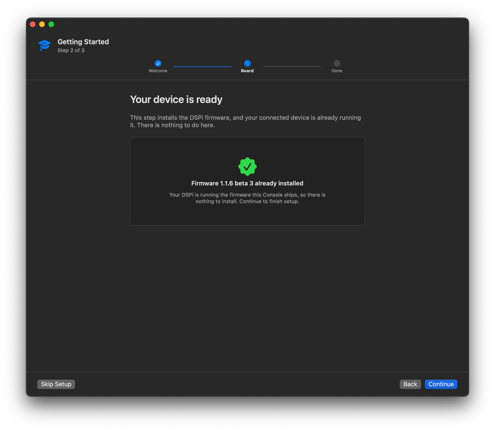

1. **Welcome** explains what happens next. Click **Continue**.
2. **Board** installs or checks the firmware.
   - If no board is connected, the page shows **Waiting for your Pico**. Hold the **BOOTSEL** button on the board while you plug it in. This starts the board's built-in bootloader, which appears to your Mac as a small drive.
   - When Console finds the board it shows **RP2040 (Pico) found** or **RP2350 (Pico 2) found**, then **ready** once the drive has mounted. Click **Install DSPi Firmware**.
   - If a DSPi is already running, the page tells you whether its firmware matches. It offers **Update DSPi Firmware** for older firmware or **Downgrade Firmware** for newer firmware. If the firmware already matches, nothing needs installing.
   - During installation a progress bar shows the write. Near the end the board restarts and its drive disappears. That is expected, so leave the board plugged in.
   - When the board comes back running the right version, the page reads **Firmware installed** and **Continue** becomes available.
3. **Done** gives you a few pointers for what to do next. Click **Start Using DSPi Console**.

**Skip Setup** is always available and closes the wizard for good (you can still reopen it from the Help menu). **Back** returns to the previous step, except while an installation is running.

After setup, choose **DSPi** as your Mac's sound output in System Settings > Sound, or in Audio MIDI Setup.

### Connecting a Device

Console connects automatically when a DSPi is plugged in, and reconnects when it is unplugged and plugged back in. The connection status sits at the top right of the main window, above the graph:

- A **green dot** means a device is connected. A **red dot** means nothing is connected. Hover the red dot to see the last connection error.
- **No Devices** in red means no DSPi is attached.
- The device name reads **DSPi** followed by the last eight characters of its serial number. If more than one DSPi is attached, the name becomes a menu, and choosing another device switches Console to it.
- **Right-click the device name** to force Console to rescan USB and reconnect. This is useful if a device stops responding.

When you switch between devices, Console first protects your work. If the Settings window holds changes you have not saved, it asks whether to **Discard and Switch** or **Cancel**. If the active preset has unsaved changes, it offers to save them first (see [Unsaved Changes](#unsaved-changes)).

With several inputs over USB (RP2350 only), the number of input channels Console shows follows the format you choose for the DSPi in **Audio MIDI Setup**: 2, 4, 6 or 8 channels. S/PDIF input always shows 2 channels, I2S input shows its configured count, and ADAT shows 8. The RP2040 always has 2 inputs.

### Firmware Version Warning

If the connected board runs a different firmware version from the one this Console expects, an orange banner appears across the top of the main window.

- If the board is **older**, the banner reads "This device runs firmware X; DSPi Console expects Y." Click **Update...** to open the [Firmware Update](#firmware-updates) window.
- If the board is **newer**, the banner says some of its features may not be shown. Click **Details...** to open the same window, which can downgrade the board if you want.
- **Hide** removes the banner until you next start Console.

Running mismatched versions is not supported, because Console decides which features to show from the version the board reports.

### How Changes Are Stored

Everything you change in Console is sent to the device **immediately**, so you hear each change as you make it. However, most changes are only held in the device's working memory. They are lost when the board loses power, unless you save them to its flash memory.

There are three kinds of storage:

| What | Where it is kept | How to save it |
|---|---|---|
| Audio settings: EQ, crossovers, gains, delays, routing, effects, channel names | The active **preset slot** (the device has 10) | Save the preset. See [Presets and Saving](#presets-and-saving). |
| Board settings: startup preset, volume modes, DAC mute, control interfaces, control surfaces | The device's own settings area, separate from presets | The **Save** bar in the Settings window. See [The Settings Save Bar](#the-settings-save-bar). |
| Hardware wiring (pins, output types, clocks, input configuration, output limiters) and master volume | Either in each preset, or stored once for the whole board, depending on a mode you choose | See [Saving Master Volume and Output Configuration](#saving-master-volume-and-output-configuration) and [Global Parameters](#global-parameters). |

A trailing `*` on the preset name in the sidebar means the live state differs from what is stored in the active preset. Console warns you before any action that would throw those changes away.

Console has no Undo. If you want a safety net before a large change, save the preset or export a [device configuration file](#device-configuration-files) first.

---

## The Main Window

### Window Layout

The main window has a fixed size. On the left is the **sidebar**, which lists your channels and holds the global controls. On the right, the **response graph** sits on top and the **page area** sits below it. The page area shows either the [Dashboard](#dashboard) or the page for the channel you selected.

You can drag the divider between the sidebar and the content to make the sidebar a little wider or narrower. Clicking any empty background area finishes a rename in progress and takes keyboard focus away from text fields.

Closing the main window quits Console. If the active preset has unsaved changes, Console asks what to do first (see [Unsaved Changes](#unsaved-changes)).

### Channel List

The sidebar lists every channel under two headings.

- **INPUTS** lists the inputs that are live: 2 on the RP2040, and 2, 4, 6 or 8 on the RP2350, depending on the input source and format.
- **OUTPUTS** lists each **enabled** output. On the RP2040 these are OUT1 to OUT4 (two stereo pairs) and OUT5 (the PDM subwoofer output). On the RP2350 they are OUT1 to OUT8 (four stereo pairs) and OUT9 (PDM). Disabled outputs are hidden; you enable them in the [Matrix Mixer](#matrix-mixer).

Each row shows the channel's name, a live level meter in the channel's colour, and a small pill such as **IN1** or **OUT3**.

| Action | Result |
|---|---|
| Click a row | Opens that channel's page. Clicking the row of the page already open returns to the Dashboard. |
| Option-click a row | Renames the channel in place. |
| Right-click an input row | **Rename**, **Copy Parameters**, **Paste Parameters**. |
| Right-click an output row | **Identify**, **Rename**, **Copy Parameters**, **Paste Parameters**. |
| Click the IN or OUT pill | Shows or hides that channel's curve on the response graph. A grey pill means the curve is hidden. |

**Renaming.** Type the new name and press Return, or click elsewhere. Names can be up to 31 characters and are stored on the device. An empty name is ignored. You can also rename outputs from the [Matrix Mixer](#matrix-mixer), and reset every name from [Advanced](#advanced) settings.

**Identify** plays a short identification tone on that output alone: two passes of quiet blips at -12 dBFS. Use it to check which physical speaker a channel drives. It needs firmware with the [Signal Generator](#signal-generator), and stops any signal the generator was playing.

**Copy and Paste Parameters** are described in [Copying Channel Settings](#copying-channel-settings).

**Meters and clipping.** When a channel clips, a small red marker appears at the right end of its meter. It clears itself 10 seconds after the last clip. The meter of a muted output is drawn faded.

**Linked inputs.** When an input pair is linked (see [Input Channel Pages](#input-channel-pages)), both rows highlight together.

**Curve visibility.** Opening a channel page shows only that channel's curve (and its linked partner's). Returning to the Dashboard restores whichever curves you had shown there.

### Quick-Access Buttons

A row of icons at the bottom of the sidebar gives one-click access to common tools. An icon lights up while its feature is on or its window is open.

| Icon | Name | Click | Right-click |
|---|---|---|---|
| Vertical sliders | Matrix Mixer | Opens or closes the [Matrix Mixer](#matrix-mixer) | - |
| Headphones | Headphone Crossfeed | Turns crossfeed on or off | Opens the [Crossfeed](#headphone-crossfeed) window |
| Speaker | Loudness Compensation | Turns loudness on or off | Opens the [Loudness](#loudness-compensation) window |
| Waveform | Volume Leveller | Turns the leveller on or off | Opens the [Volume Leveller](#volume-leveller) window |
| Bass clef | Psychoacoustic Bass | Turns psychoacoustic bass on or off | Opens the [Psychoacoustic Bass](#psychoacoustic-bass) window |
| Info | Stats for Nerbs | Opens or closes [System Statistics](#system-statistics) | - |
| Gear | Settings | Opens or closes [Settings](#settings) | - |
| Cross | Bypass Master EQ | Bypasses the input EQ (lit while bypassed) | - |

**Bypass Master EQ** lets you compare the sound with and without your input filters. While it is on, the input curves on the graph are drawn flat.

### Preset Picker

The **Preset** menu shows the ten preset slots on the device. Each entry shows the preset's name, **Preset N** for a stored preset without a name, or **Empty**. A `*` after the active preset's name means it has unsaved changes. The menu is unavailable while no device is connected.

Choosing another slot loads it. If the current preset has unsaved changes, Console asks first. Right-click the Preset row for more actions such as Save, Rename and Copy. Both are covered in [Working with Preset Slots](#working-with-preset-slots) and [The Preset Menu](#the-preset-menu).

### Input Source Picker

The **Source** menu chooses where the audio comes from. It appears only when the firmware supports more than one source. Only the sources that are available and enabled appear:

- **USB**: audio from your Mac.
- **S/PDIF** (shown as **S/PDIF 1** when extra S/PDIF inputs are enabled), and **S/PDIF 2**, **S/PDIF 3** and **S/PDIF 4** when enabled in [Inputs](#inputs) settings.
- **I2S**: a digital audio stream from an ADC or another device.
- **ADAT** (RP2350): eight channels over an optical lightpipe, once ADAT input is enabled and has a pin.

The inputs themselves are configured in the [Inputs](#inputs) settings page.

### Volume Controls

The heading above the volume slider is a menu. Use it to choose which volume the slider controls: **User Volume** or **Master Volume**. Console remembers your choice.

- **User Volume** is the listening volume, from -60 dB to 0 dB. It is the same control as the volume slider macOS shows for the DSPi. Moving the macOS volume moves this slider, but Console never changes your Mac's own system volume. The slider has more travel near the top, where fine control matters most.
- **Master Volume** is a second, overall level for the whole device, from 0 dB down to -128 dB, which is shown as **-∞** (muted). The slider is red. It moves in 0.1 dB steps near the top, then in coarser steps further down.

Right-click either slider to reset it to 0 dB. Whether master volume is stored with each preset or once for the board is set in [Global Parameters](#global-parameters).

### CPU Meters

At the bottom of the sidebar, **C0** and **C1** show the load on the DSPi's two processor cores. A bar turns red above 90%. If a core stays that high, audio may drop out. Turn off effects you don't need, or disable unused outputs in the [Matrix Mixer](#matrix-mixer).

### Dashboard

The Dashboard is the page you see when no channel is selected. It gives a read-only summary of the filters on each channel.

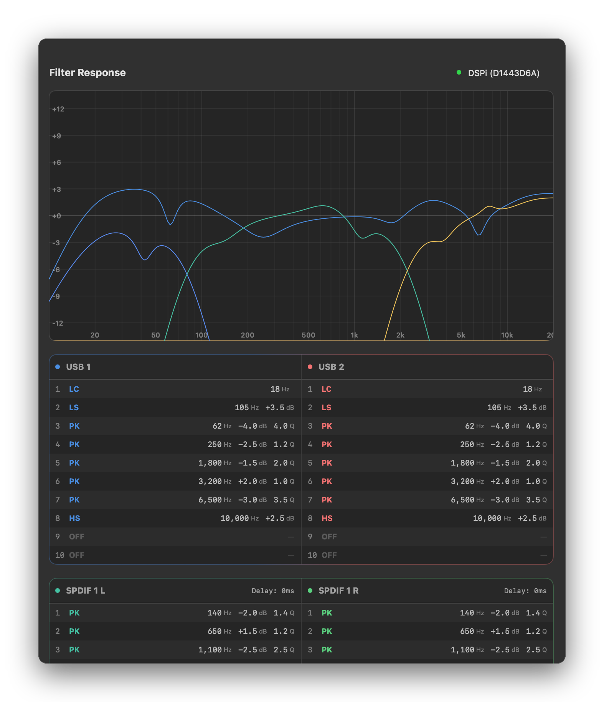

- The first card shows inputs 1 and 2.
- Each output pair gets a card. If both outputs are enabled, they appear side by side; if only one is, it gets its own card. The PDM subwoofer output gets a card when enabled.
- Output cards show each channel's delay.
- Each row shows the band number, a short type code, and the frequency, gain and Q where they apply. Off bands show a dash.

The type codes are: **PK** (peaking), **LS** and **HS** (low and high shelf), **LC** and **HC** (low and high cut), **NO** (notch), **AP** (all-pass), and first-order versions with a **1** suffix (for example **LS1**). **LT** is a Linkwitz Transform. See [Filter Types](#filter-types).

**Card layout.** Hover over any card and click the gear at its top right to choose how many cards sit on each row: **Auto** (as many as fit), **1**, **2** or **3**. The setting applies everywhere and is remembered.

Crossover bands and per-band bypass are not shown on the Dashboard. Open the channel page to see them.

---

## Channel Pages

Click a channel in the sidebar to open its page. The page appears below the graph, and the graph switches to editing that channel's filters (see [On-Graph Filter Editing](#on-graph-filter-editing)). Click the same channel again to return to the Dashboard. If the device disconnects, Console returns to the Dashboard.

Each input channel has 10 parametric EQ (PEQ) bands. Each output channel has 10 PEQ bands plus 4 crossover bands, when the firmware supports crossovers.

### Input Channel Pages

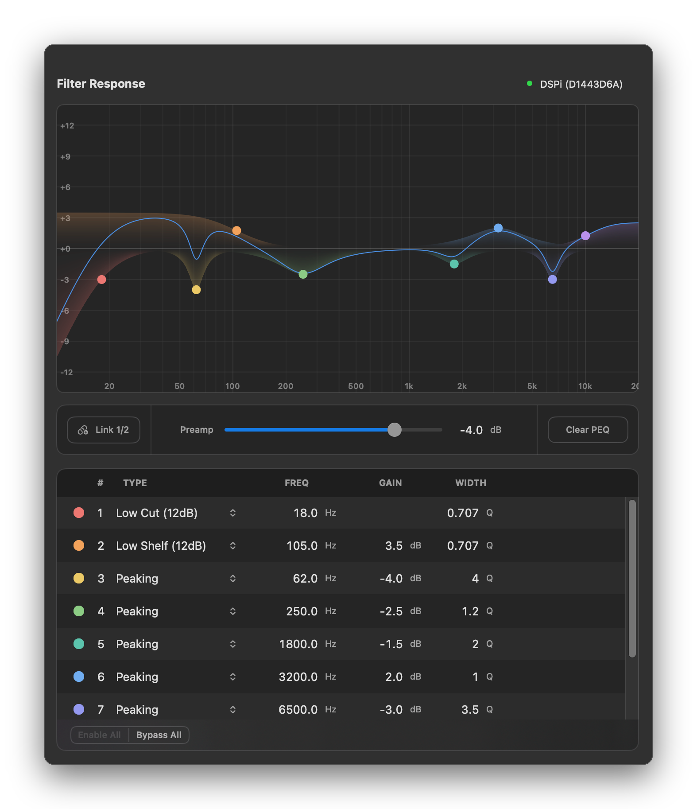

The header card of an input page holds three controls.

**Link** (for example **Link 1/2** or **Link 3/4**) joins an input to its neighbour as a stereo pair. It appears only when both inputs of the pair are live.
- While a pair is linked, any preamp change or filter edit on one channel is copied to the other. That includes band edits, bypass, clearing and pasting. Opening either channel shows both curves.
- If the two channels already have different filters or trims when you link them, Console asks which one to keep. Choose **Keep IN1** or **Keep IN2** (or whichever pair you are linking) to copy that channel's settings onto the other, or **Cancel**. Copying overwrites the other channel.
- Inputs 1 and 2 are linked by default. Console remembers links for each device. A link is paused, but not forgotten, while fewer inputs are active.

**Preamp** sets the input gain before the filters, from -60 dB to +10 dB, in 0.1 dB steps. Drag the slider or type a value. Right-click the slider to reset it to 0 dB. If you boost with EQ, lower the preamp by a similar amount so loud passages don't clip.

**Clear PEQ** (or **Clear 1/2 PEQ** on a linked pair) sets every PEQ band on the input to Off at once. It does not ask for confirmation.

Below the header is the [band list](#the-band-list).

### Output Channel Pages

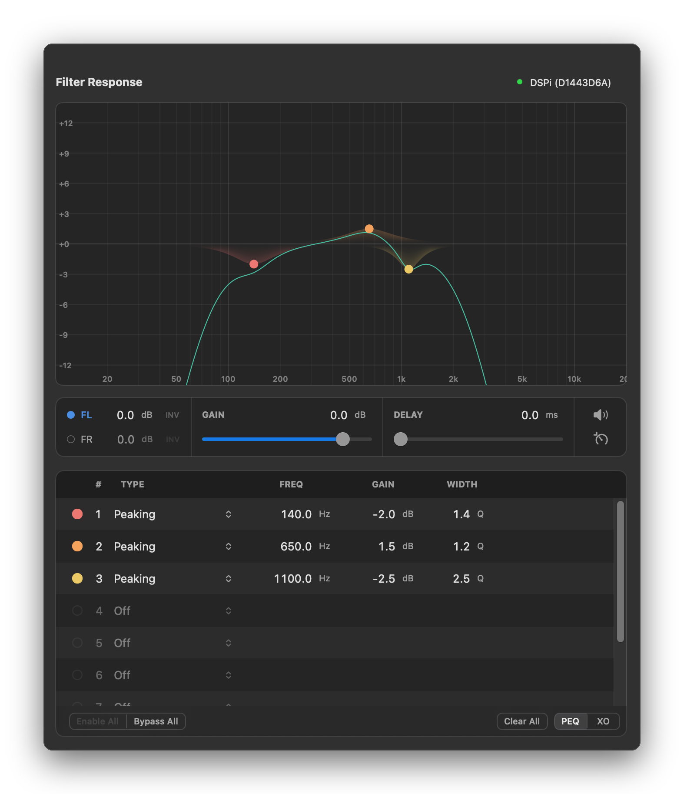

The settings card of an output page holds, from left to right:

1. **Routing preview.** This shows inputs 1 and 2 and how they feed this output. It is a shortcut to part of the [Matrix Mixer](#matrix-mixer), which holds the full routing.
   - Click an input's name to connect it to this output or disconnect it.
   - The **dB** field sets the level at which that input feeds this output. You can set it before connecting. Right-click it to reset it to 0 dB.
   - **INV** inverts the polarity of that input on this output. It turns orange when active.
2. **GAIN**: the output level, from -60 dB to +10 dB in 0.1 dB steps. Right-click the slider to reset it to 0 dB.
3. **DELAY**: delays this output so that speakers at different distances arrive at your ears together. The range is 0 to 42 ms on the RP2040 and 0 to 85 ms on the RP2350. Delay is applied in whole milliseconds. Sound travels about 34 cm (13.5 inches) per millisecond, so delay the nearer speaker by its distance difference divided by that figure. Right-click the slider to reset it to 0.
4. **Mute**: the speaker icon mutes the output. It turns red with a slash while muted.
5. **Output limiter**: the gauge icon under the mute button. See [Output Limiter](#output-limiter).

Below the card is the band list. Output pages have two tabs at the foot of the list: **PEQ** for the parametric bands and **XO** for the [crossover bands](#crossover-bands).

### Output Limiter

Each output has its own brickwall limiter. The limiter makes sure that no sample leaves the output above a ceiling you set. Use it to protect an amplifier or speaker from overload. It appears on output pages when the firmware supports it.

The gauge icon under the mute button shows the limiter's state:
- **Grey** means it is off.
- **Accent colour** means it is on.
- **Orange** means it is reducing the level right now.

**Click** the icon to switch the limiter on or off. **Right-click** it to open its settings.

| Control | What it does |
|---|---|
| On/off switch | Turns this output's limiter on or off. Test signals from the [Signal Generator](#signal-generator) are limited too, so switch it off for full-scale measurements. |
| **Threshold** | The ceiling, from -30 to 0 dBFS. No sample leaves the output above it. The default is -1 dBFS. |
| **Release** | How fast the level recovers after a peak, from 10 to 1000 ms. The attack is fixed and very short. |
| **Link group** | **Off**, or group **1** to **4**. Outputs in the same group share the deepest gain reduction, so a stereo image doesn't shift when only one side peaks. Each output keeps its own threshold and release. Only outputs whose limiter is on take part. |
| **Copy to all outputs** | Copies this output's threshold, release and on/off state to every output. It does not copy link groups. |
| **All outputs** menu | **Link all stereo pairs** puts outputs 1 and 2 in group 1, outputs 3 and 4 in group 2, and so on (PDM stays unlinked). **Unlink all outputs** clears every group. **Switch every limiter off** does what it says. |

Limiter settings are part of the hardware configuration. They are stored with the preset or once for the board, depending on the mode in [Global Parameters](#global-parameters).

### The Band List

The band list shows one row per filter band. On the PEQ tab the columns are **#**, **TYPE**, **FREQ**, **GAIN** and **WIDTH**.

- **Bypass dot** (left of the number): a filled dot means the band is active, and a hollow ring means it is bypassed. Click to toggle. A bypassed band is dimmed in the list and drawn flat on the graph. This needs firmware with per-band bypass.
- **#**: the band number, in the band's own colour. The same colour marks the band's dot on the graph. Click the number to select the band on the graph.
- **TYPE**: click to choose a filter type. See [Filter Types](#filter-types).
- **FREQ**: the band's centre or corner frequency in Hz.
- **GAIN**: boost or cut in dB. Only peaking and shelf filters have gain; the field is blank for other types.
- **WIDTH**: the band's Q. A higher Q gives a narrower band. It is hidden for types without a Q.

The list and the graph stay in step. Hovering a row lights up that band on the graph, and selecting a band on the graph highlights and scrolls to its row.

At the foot of the list:

- **Enable All | Bypass All** switches every non-Off band on or off in one step. Each half is dimmed when it would change nothing. It appears only with firmware that supports per-band bypass.
- **Clear All** (output pages) resets every band in the current tab to Off. Console asks **Clear All Bands?** before it does this. Input pages use **Clear PEQ** in the header instead.
- **PEQ | XO** (output pages) switches between the parametric and crossover bands.

A new or cleared band is Off, with a frequency of 1000 Hz, Q 0.707 and 0 dB gain.

### Filter Types

Click a band's **TYPE** to open the type menu. Types with more than one slope open a submenu. The menu lists only the types the connected firmware supports.

| Menu item | What it does | Adjustable |
|---|---|---|
| **Off** | The band does nothing. | - |
| **Peaking** | A bell-shaped boost or cut around a frequency. The most common EQ filter. | Frequency, gain, Q |
| **Low Shelf** (6 or 12 dB/oct) | Raises or lowers everything below the frequency. | Frequency, gain, Q (12 dB only) |
| **High Shelf** (6 or 12 dB/oct) | Raises or lowers everything above the frequency. | Frequency, gain, Q (12 dB only) |
| **High Cut** (6 or 12 dB/oct) | Removes content above the frequency (a low-pass filter). | Frequency, Q (12 dB only) |
| **Low Cut** (6 or 12 dB/oct) | Removes content below the frequency (a high-pass filter). | Frequency, Q (12 dB only) |
| **Notch** | A very narrow, deep cut, for removing a single tone such as hum. | Frequency, Q |
| **All Pass** (180° or 360°) | Changes phase around the frequency without changing level. Used to align drivers in time around a crossover. | Frequency, Q (360° only) |
| **Linkwitz Transform** | Extends the bass of a sealed-box speaker. Output channels only. See [Linkwitz Transform](#linkwitz-transform). | Special |

The TYPE button shows the full name with its slope, for example **Low Shelf (12dB)** or **All Pass (360°)**.

### Crossover Bands

On an output page, the **XO** tab shows four crossover bands. A crossover splits the signal so that each speaker driver gets only the frequencies it should play. For example, you might send lows to a woofer output and highs to a tweeter output.

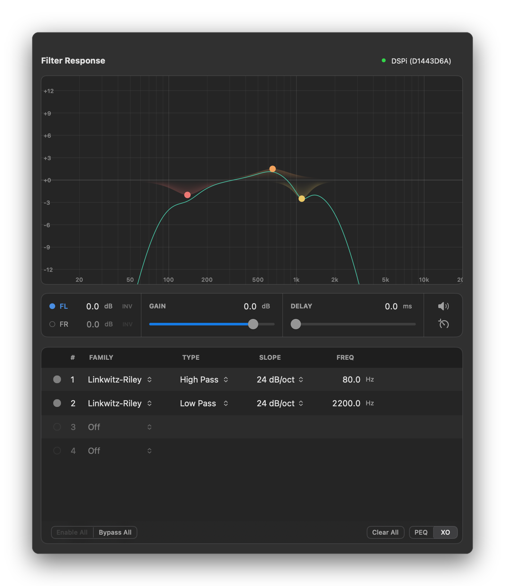

The XO columns are **#**, **FAMILY**, **TYPE**, **SLOPE** and **FREQ**.

- **FAMILY**: **Off**, **Linkwitz-Riley**, **Butterworth** or **Bessel**. Linkwitz-Riley is the usual choice, because its low and high halves sum flat.
- **TYPE**: **Low Pass** or **High Pass**.
- **SLOPE**: how steeply the filter cuts, in dB per octave. Linkwitz-Riley and Bessel offer 12, 24, 36 and 48. Butterworth offers 6 to 48 in 6 dB steps. If you change the family, Console keeps the slope when it can, or picks the nearest one.
- **FREQ**: the crossover frequency in Hz.

Crossover bands have no gain or Q; the family and slope set their shape.

**Bypass All** on the XO tab asks for confirmation. Bypassing crossovers sends full-range audio to the output, which can damage a tweeter or other driver that relies on the crossover for protection.

### Linkwitz Transform

A Linkwitz Transform reshapes the low-frequency roll-off of a sealed-box woofer. It takes the driver's own resonance (f0, Q0) and turns it into a target response (fp, Qp), usually a lower and flatter one. It is available on output channels only.

When a band is set to **Linkwitz Transform**, its FREQ column shows a sliders icon. Click it to open the editor.

- **Driver**: **f0** (Hz) and **Q0** describe the woofer in its box. You can get these from the driver's measurements or from box-design software.
- **Target**: **fp** (Hz) and **Qp** describe the response you want.
- **DC boost** shows how much the filter boosts the lowest frequencies. It turns orange with a warning above +15 dB, because large boosts cost headroom and cone excursion.
- Edits here are not sent until you click **Apply** (or press Return). **Revert** discards them. The status line reads **Not applied yet** or **Applied**. Unapplied edits are discarded when the editor closes.

When you first switch a band to Linkwitz Transform, the target starts equal to the driver values, so it has no effect until you change fp or Qp.

### Copying Channel Settings

You can copy one channel's settings and paste them onto another. This uses Console's own clipboard, not the Mac clipboard.

- **Copy**: right-click the channel in the sidebar and choose **Copy Parameters**, or open the channel page and press **Cmd+C** (with no text field active).
- **Paste**: right-click the destination channel and choose **Paste Parameters**, or open its page and press **Cmd+V**.

| Copied from | What is copied |
|---|---|
| An input | Its 10 PEQ bands. The preamp is not copied. |
| An output | Its PEQ bands, crossover bands, gain, delay and mute. |

Pasting always replaces all 10 PEQ bands. Pasting onto a linked input also updates its partner. Crossover, gain, delay and mute are pasted only when both source and destination are outputs.

The [Matrix Mixer](#matrix-mixer) column headers offer the same Copy and Paste Parameters commands.

### Value Fields and Sliders

Numeric fields and sliders work the same way throughout Console:

- **Type a value**: click the number, type, then press Return or click elsewhere. Text that is not a number is ignored and the old value returns. You don't need to type the unit.
- **Scroll to adjust**: hold **Cmd** and scroll over a value field to step it up or down. Plain scrolling scrolls the page instead, so you can't change a value by accident. For example, frequency fields step by 10 Hz and Q fields by 0.1.
- **Drag a slider**: the device follows as you drag, and the final value is committed when you let go.
- **Right-click a slider** to reset it. This works on the volume, preamp, output gain and output delay sliders, and on the routing gain fields.

The compact fields in the [Matrix Mixer](#matrix-mixer) are the exception: plain scrolling adjusts them directly.

---

## The Response Graph

The response graph at the top of the main window shows the frequency response of your filters, which is how much each frequency is boosted or cut. Console computes it with the same maths as the firmware, so the curve matches what the device actually does.

### Reading the Graph

- The horizontal axis is frequency, on a logarithmic scale, labelled from 20 Hz to 20k (20 kHz). The vertical axis is level in dB. A brighter line marks 0 dB, which means no change.
- Each visible channel is drawn in its own colour. When several channels have identical curves, Console draws them as one line with a colour gradient.
- An output's curve includes its crossover and its output gain.
- On a channel page, the selected channel is drawn as a solid curve with band dots (see [On-Graph Filter Editing](#on-graph-filter-editing)). Other visible channels, such as a linked partner, are drawn dashed.
- If **Phase Response** is on, the selected channel's phase is drawn as a dotted grey line, with the phase scale on the right edge.
- If the spectrum display is on, the live audio spectrum is drawn behind the curves. See [Spectrum Display](#spectrum-display).
- Without a connected device the grid stays but the curves fade out.

Choose which channels are drawn by clicking the **IN** and **OUT** pills in the sidebar (see [Channel List](#channel-list)).

### Graph Options

Hover over the graph and a **gear** appears at its top right. Click it to open the graph options. The Dashboard and the channel pages each keep their own spectrum options, and the gear's tooltip tells you which one you are changing.

- **SPECTRUM** chooses which channels' live spectrum to display.
  - The **Inputs | Outputs** switch picks a side. The analyser measures one side at a time, and each side remembers its own channels.
  - Click a channel chip to include or exclude it. The chips use the channel colours.
  - The summary reads **Spectrum hidden**, **1 channel** or **N channels**. **Clear** unticks them all.
  - If the firmware has no analyser, or no device is connected, this section says so instead.
- **FFT Graph** draws the spectrum inside the response graph.
- **RTA Bars** shows a separate bar display below the graph (see [Spectrum Display](#spectrum-display)).
- **Graph Setup ›** opens the display settings described below.
- **Pop Out Graph** moves the graph into its own window (see [Pop-Out Graph Window](#pop-out-graph-window)).

Opening a channel page starts that page's spectrum on the channel you opened.

### Graph Setup

**Graph Setup** controls how the graph is drawn. The same settings also appear in Settings under [Graphing](#graphing).

| Section | Setting | Range | Default |
|---|---|---|---|
| **SCALE** | **Frequency** (from / to) | 10, 15, 20, 50 or 100 Hz, to 5, 10 or 20 kHz | 15 Hz to 20 kHz |
| | **Range**: total height of the dB axis | 10 to 100 dB | 50 dB |
| | **Center**: the level at the middle of the graph | -40 to +20 dB | 0 dB |
| | **Reset** | Restores the four scale settings above | - |
| **GRID & LABELS** | **Frequency Grid**, **Frequency Labels**, **dB Grid**, **dB Labels** | On or off | On |
| | **Grid Opacity**: 0% hides the grid, 100% is standard, 200% is twice as strong | 0 to 200% | 50% |
| **CURVES** | **Line Width** | 1 to 4 pt | 2 pt |
| | **Glow**: a soft neon glow on the curves | On or off | On |
| | **Phase Response**: the selected channel's phase as a dotted line | On or off | Off |
| | **Unwrap Phase**: continuous phase instead of jumping at ±180° | On or off (needs Phase Response) | Off |
| | **Follow Channel Selection** (pop-out window only) | On or off | On |

**Back** returns to the main options page. You can also change the dB range without opening the settings: scroll with the pointer over the dB labels at the left edge of the graph to zoom in or out.

### Resizing the Graph

Drag the thin strip under the graph up or down to change its height, between 200 and 350 points. The page area below gets smaller or larger to match; the window size doesn't change.

### Pop-Out Graph Window

Choose **Pop Out Graph** from the graph options to move the graph into its own resizable window. This is useful on a second display. While the graph is popped out, the main window hides its copy and shows a small collapse button in its place. Click that button, or close the pop-out window, to bring the graph back.

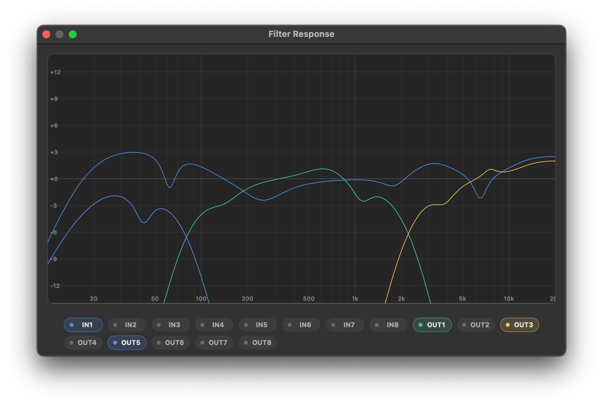

The pop-out window has a legend under the graph. It shows one pill per active input and enabled output; click a pill to show or hide that channel's curve.

**Follow Channel Selection** (in the pop-out's Graph Setup) controls how the pop-out relates to the main window:

- **On** (the default): the pop-out mirrors the main window's selected channel and visible curves. You can edit bands on the pop-out graph just as on the main one.
- **Off**: the pop-out keeps its own set of visible curves, starting with every active input and enabled output. Filters can't be edited on the graph in this mode.

### Spectrum Display

The DSPi has a built-in spectrum analyser that measures the audio passing through it. Console can show it in three places.

- **FFT Graph** draws the spectrum as a filled shape behind the response curves, in each channel's colour. Its level scale is separate from the EQ scale. The bottom of the graph is the analyser's floor and the top is its ceiling, both set in [Spectrum Analyser Settings](#spectrum-analyser-settings).
- **RTA Bars** shows third-octave bars in a strip below the graph, one cell per channel.
  - Hover the strip to reveal its gear. Under **LAYOUT** you can choose 1 to 4 columns, and **Open in Window** opens the [Spectrum Analyser](#spectrum-analyser) window.
  - Drag the bottom edge of the strip to make the bars taller or shorter.
- The [Spectrum Analyser](#spectrum-analyser) window shows the same measurement larger.

Choose the channels in [Graph Options](#graph-options). The analyser only runs while something is showing it, so it costs nothing when hidden. Its look and resolution are set in [Spectrum Analyser Settings](#spectrum-analyser-settings).

---

## On-Graph Filter Editing

On a channel page, you can create and shape filters directly on the response graph, much like a modern plug-in EQ. Every change is sent to the device as you make it, and the band list below follows along.

Each band appears as a coloured **dot**, in the same colour as its number in the band list. A soft coloured area (the band's "lobe") shows each band's own contribution. Lobes and outlines brighten when you hover over or select a band, so the graph stays uncluttered otherwise.

### When Editing Is Available

On-graph editing works when all of these are true:

- A channel page is open. The Dashboard shows curves only.
- A device is connected.
- The channel's curve is visible (its sidebar pill is not grey).
- In the pop-out window, **Follow Channel Selection** is on.

The graph edits the channel whose page is open. To edit another channel, click it in the sidebar. Only PEQ bands appear as dots. On output pages, crossover bands shape the curve but are edited in the [XO tab](#crossover-bands). On a linked input pair, every graph edit is copied to the partner channel.

### Hovering

- **Over a band's dot or lobe**: the band lights up, its row in the band list is highlighted, and the pointer becomes an open hand. If you rest on it for a moment, the band list scrolls to show that band.
- **Over a dot, with nothing selected**: the [band chip](#the-band-chip) appears beside the dot and shows the band's values. It hides again shortly after you move away.
- **Over empty graph**: a faint "ghost" dot shows where a double-click would create a band, and a label at the bottom shows the frequency under the pointer. If every band is in use, the label reads **All N bands in use** instead.
- **Over a row in the band list**: that band lights up on the graph.

### Adding Bands

A new band goes into the lowest-numbered band that is Off, and is selected straight away. If every band is already in use, Console beeps and nothing is added.

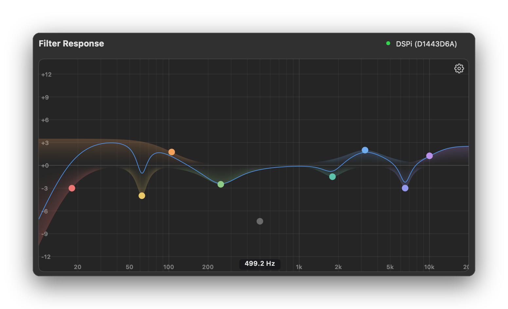

- **Double-click** (or **Cmd-click**) empty graph. The kind of band depends on where you click:
  - Near the **left edge**: a **Low Cut** (12 dB/oct, Q 0.707).
  - Near the **right edge**: a **High Cut** (12 dB/oct, Q 0.707).
  - Near the **bottom**, below -6 dB: a **Notch** (Q 1).
  - **Anywhere else**: a **Bell** (peaking filter) at that frequency and gain, with Q 1.
- **Drag the curve itself.** Press on the channel's curve and pull, and a new band is drawn out of it, starting at 0 dB so the curve doesn't jump. Near the left edge it is a **Low Shelf**, near the right edge a **High Shelf**, and anywhere else a **Bell**.
- **Right-click empty graph** and choose **Add Band Here**, then a shape. The band is placed at the pointer's frequency, and bells and shelves take the pointer's level as their gain.

A single click on empty graph never adds a band; it only clears the selection. A Linkwitz Transform can't be created on the graph; use the band list.

### Selecting Bands

| Action | Result |
|---|---|
| Click a dot or lobe | Selects that band only. |
| Cmd-click a band | Adds it to, or removes it from, the selection. |
| Shift-click a band | Selects every band between the last one you clicked and this one, in frequency order. |
| Drag across empty graph | Draws a dashed box and selects every band whose dot is inside it. Hold Shift or Cmd as you start to add to the existing selection. |
| Click empty graph, or press Escape | Clears the selection. |
| Cmd-A, or right-click > **Select All Bands** | Selects every band. |
| Tab / Shift-Tab | Selects the next or previous band by frequency. |
| Click a band number in the band list | Selects that band. |

While bands are selected, the band chip stays with the selection, and hovering other bands only highlights them.

### Dragging Bands

Drag a band's dot (or its lobe) to change it:

- **Bells and shelves**: left and right changes frequency; up and down changes gain.
- **12 dB/oct Low Cut and High Cut**: left and right changes frequency; up and down changes Q, which sets how much the filter peaks at its corner.
- **Notch, All Pass and 6 dB/oct cuts**: only the frequency changes. Use the scroll wheel to change Q.
- **Linkwitz Transform** bands can't be dragged.

If you drag a band that is part of a selection, **all selected bands move together**. The band you grab follows the pointer, and the others shift by the same amount.

Modifier keys change how a drag behaves:

| Hold | While dragging | Effect |
|---|---|---|
| **Shift** | At any point | Fine adjustment: the band moves at about one eighth of the speed. Press or release it mid-drag as needed. |
| **Option** | At any point | Locks the drag to one axis (frequency only, or gain/Q only). If you press Option mid-drag, Console locks to the direction you have mostly been moving. Release Option to free the drag again. The band never jumps. |
| **Cmd** | From the start | Changes Q instead of position: drag up to raise Q (narrower), down to lower it (wider). |

When you hold Option, Shift or Cmd and **release without moving**, the press counts as a click instead:

- **Option-click** a dot bypasses the band, or re-enables it. If the band is part of a selection, the whole selection is toggled. This needs firmware with per-band bypass.
- **Shift-click** and **Cmd-click** select, as described in [Selecting Bands](#selecting-bands).

**Double-click a dot** to open the band chip with the frequency ready to type.

The device updates live while you drag, and the change is saved into the channel when you let go.

### Scroll Wheel and Trackpad

| Where | Scroll | Effect |
|---|---|---|
| Over a band | Scroll | Changes the band's **Q** (width). |
| Over a band | **Cmd**-scroll | Changes the band's **gain** (bells and shelves only). |
| Over a band | Add **Shift** | Fine adjustment. |
| Over the left edge (the dB labels) | Scroll | Zooms the graph's dB range in or out. This also works on the Dashboard. |
| Over empty graph elsewhere | Scroll | Scrolls the page as normal. |

When bands are selected, scrolling over any band or over the chip adjusts **the whole selection**. To work on a different band, click it first.

A scroll gesture stays with the band it started on, even if the dot moves out from under the pointer. You can also scroll during a drag to change Q at the same time. Scroll changes are sent live and saved a moment after you stop.

### The Band Chip

The band chip is a small dark card next to a band's dot. It shows the band's values and lets you edit them precisely. It appears when you hover a dot, select a band, or start editing. It sits above boosted bands and below cut bands, and always stays inside the graph.

**Header:**
- The **shape button** on the left shows the band's shape icon and a two-letter code: **PK** (Bell), **LS** (Low Shelf), **LC** (Low Cut), **HS** (High Shelf), **HC** (High Cut), **NT** (Notch) or **AP** (All Pass). Click it to open the [shape strip](#changing-shape-and-slope). A Linkwitz Transform shows **LT** and must be edited in the band list.
- The **power button** on the right bypasses or re-enables the band, or the whole selection if the band is part of one. It appears when the firmware supports per-band bypass.

**Values** (only the rows a shape uses):

| Row | Meaning | Shown for |
|---|---|---|
| **Freq** | Frequency, in Hz or kHz | Every shape |
| **Gain** | Boost or cut in dB | Bells and shelves |
| **Width** | Q | Shapes that have a Q |
| **Slope** | 6 dB/oct (read-only) | 6 dB/oct shelves and cuts |
| **Order** | 1st (read-only) | 180° All Pass |
| **f0**, **fp** | Driver and target frequencies (read-only) | Linkwitz Transform |

To change a value in the chip:

- **Drag it up or down** (the pointer shows up and down arrows). Hold **Shift** for fine steps.
- **Scroll over it.** Hold **Shift** for fine steps. **Cmd**-scroll anywhere on the chip always changes gain.
- **Double-click it and type.** Press **Return** to apply, **Tab** or **Shift-Tab** to apply and move to the next or previous field, and **Escape** to cancel. If Console can't read what you typed, it beeps and keeps the old value.
  - **Freq** accepts plain Hz (`440`), kilohertz (`2k`, `2.5 kHz`), and musical note names such as `A4` (440 Hz), `C#2` or `Bb3`. You can add cents too, as in `C#2+13`. C4 is middle C.
  - **Gain** accepts a number, with an optional `+` and `dB`.
  - **Width** accepts a number, with an optional leading `q`.

The chip has no delete button. Use the Delete key or the right-click menu.

### Changing Shape and Slope

Click the chip's shape button to open the **shape strip**. It is a row of icons for Bell, Low Shelf, Low Cut, High Shelf, High Cut, Notch and All Pass, limited to the shapes your firmware supports. The current shape is highlighted.

If the current shape comes in two slopes, buttons after the divider choose between them: **6 dB** and **12 dB** for shelves and cuts, or **1st** and **2nd** order for All Pass.

Clicking a button changes the band, or the whole selection if the band is part of one, and closes the strip. The frequency is kept. If the new shape has no gain, the gain is set to 0. If the new shape uses Q and the old one didn't, Q is set to a sensible starting value.

### Right-Click Menus

**Right-click a band** to open the band menu. It acts on the whole selection if the band is part of one, and otherwise on that band alone.

- The title shows **Band N** or **N Bands**.
- **Shape** lets you choose a new shape.
- **Slope** offers **6 dB/oct** or **12 dB/oct**; for All Pass it is **Order**, with **1st Order** or **2nd Order**. It appears only when both are available.
- **Edit Values...** opens the chip ready to type the frequency.
- **Bypass** or **Enable** needs firmware with per-band bypass.
- **Invert Gain** flips a boost into a cut of the same size, or the reverse.
- **Delete Band** or **Delete N Bands** sets the band(s) to Off.

**Right-click empty graph** to open the graph menu:

- **Add Band Here** opens a submenu of shapes. It is unavailable when every band is in use.
- **Select All Bands** and **Deselect All**.
- **Delete Selected Band** or **Delete N Selected Bands** appears when something is selected.

### Keyboard Shortcuts on the Graph

Click the graph first so it has keyboard focus.

| Key | Action |
|---|---|
| **Delete** or **Forward Delete** | Deletes the selected bands (sets them to Off). |
| **Escape** | Clears the selection and hides the chip. |
| **Tab** / **Shift-Tab** | Selects the next or previous band by frequency, wrapping round at the ends. |
| **Left** / **Right** arrow | Moves the selection down or up in frequency by 1/12 octave (one semitone). With Shift, by 1/96 octave. |
| **Up** / **Down** arrow | Raises or lowers the selection's gain by 0.5 dB, or 0.1 dB with Shift. For shapes without gain it changes Q instead. |
| **Option-Up** / **Option-Down** | Raises or lowers the selection's Q. With Shift, in finer steps. |
| **Cmd-A** | Selects every band. |

Arrow-key changes go to the device immediately and are saved a moment after the last key press.

### Graph Editing Quick Reference

| Where | Do this | Result |
|---|---|---|
| Empty graph | Double-click, or Cmd-click | Add a band (Low Cut at the left, High Cut at the right, Notch at the bottom, Bell elsewhere) |
| The curve | Drag | Pull out a new band (Low Shelf at the left, High Shelf at the right, Bell elsewhere) |
| Empty graph | Drag | Box-select bands |
| Empty graph | Click | Deselect all |
| Empty graph | Right-click | Add Band Here, Select All, Deselect All, Delete Selected |
| Left edge | Scroll | Zoom the dB range |
| Band | Click / Cmd-click / Shift-click | Select / add to selection / select range |
| Band | Option-click | Bypass or enable |
| Band | Double-click | Type a new frequency |
| Band | Drag | Move frequency and gain (or Q for 12 dB cuts) |
| Band | Cmd-drag | Change Q |
| While dragging | Shift / Option | Fine movement / lock to one axis |
| Band or chip | Scroll / Cmd-scroll | Q / gain (Shift for fine) |
| Band | Right-click | Shape, Slope, Edit Values, Bypass, Invert Gain, Delete |
| Chip value | Drag vertically, scroll, or double-click to type | Change that value |
| Chip shape button | Click | Open the shape strip |
| Chip power button | Click | Bypass or enable |
| Keyboard | Delete, Escape, Tab, arrows, Option-arrows, Cmd-A | See [Keyboard Shortcuts on the Graph](#keyboard-shortcuts-on-the-graph) |

### Editing Limits

| Value | Range |
|---|---|
| Gain | -30 to +30 dB |
| Q (Width) | 0.1 to 20 |
| Frequency (typed or created) | 10 Hz to 21.6 kHz |
| Frequency (dragged, scrolled or moved with arrows) | Also limited to the visible frequency range |
| Bands per channel | 10 |

---

## Presets and Saving

### What Gets Saved Where

The DSPi stores up to ten **presets**. A preset is a complete set of audio settings: every filter, crossover, gain, delay, mute, the routing, the effects, and the channel names. One preset is active at a time. When the board powers on, it loads its startup preset (chosen in [Global Parameters](#global-parameters)).

Changes you make in Console take effect immediately but are not stored until you save them. The table below summarises where each kind of setting goes.

| Setting | Stored in | Saved by |
|---|---|---|
| Filters, crossovers, preamps, output gain, delay and mute, routing, all effects, channel names, input source, LG Sound Sync | The active preset | Preset **Save** or **Tools > Commit Parameters...** |
| Master volume | The preset **or** the board, depending on the Master Volume mode | Preset save, or **File > Save Master Volume** |
| Hardware configuration: pins, output types, clocks, input configuration, ADAT, output limiters | The preset **or** the board, depending on the Hardware Configuration mode | Preset save, or the Settings **Save** bar, or **File > Save Output Configuration** |
| Startup preset, volume and hardware modes, DAC mute | The board | Settings **Save** bar |
| Control interfaces | The board | **Apply** on each interface |
| Control surfaces, groups, macros, aux outputs | The board | Settings **Save** bar |
| Graph, spectrum and display preferences | Your Mac | Automatic |

Board-level settings survive a change of preset.

### Working with Preset Slots

To switch presets, choose a slot from the **Preset** menu in the sidebar. If the current preset has unsaved changes, Console asks what to do with them first (see [Unsaved Changes](#unsaved-changes)).

To save your current settings into the active slot, right-click the Preset row and choose **Save**. A slot saved without a name is called **Preset N**.

Console also notices when a preset is loaded some other way, for example from a physical control, and updates itself to match.

### The Preset Menu

Right-click the **Preset** row in the sidebar for these commands:

| Command | What it does |
|---|---|
| **Save** | Saves the current settings into the active slot. It does not ask for confirmation. |
| **Rename...** | Opens a dialog to name the preset (up to 31 characters). Press Return to rename or Escape to cancel. |
| **Set as Default** | Makes this slot the one the board loads at power-on. It is unavailable if the slot already is the default. |
| **Copy to...** | Copies the current settings into another slot. The current slot stays active. If there are unsaved changes, Console asks about them first. The destination keeps its name, or becomes **Preset N**. |
| **Clear "N: name"...** | Erases the active slot back to factory defaults, after a confirmation. This cannot be undone. |
| **Clear All Slots...** | Erases every slot and name, after a confirmation. This cannot be undone. |

### Unsaved Changes

When the live settings differ from the active preset, a `*` appears after the preset's name. Before any action that would lose those changes, Console shows the **Unsaved Changes** dialog.

The dialog lists what has changed (up to 15 items, then a count of the rest), for example "Preamp L: -3.0 dB → 0.0 dB". It offers three buttons:

- **Save** stores the changes in the current preset, then carries on.
- **Discard** throws the changes away and carries on.
- **Cancel** stops, so nothing happens.

The dialog appears when you switch presets, use **Copy to...**, switch to another DSPi, or quit Console (including closing the main window). If a save fails, Console tells you and stops the action. When quitting, it asks whether to quit anyway.

Hardware settings count as preset changes only when the Hardware Configuration mode is **With Preset**. Master volume counts only when the Master Volume mode is **With Preset**. Both modes are set in [Global Parameters](#global-parameters).

### Commit, Revert and Factory Reset

The **Tools** menu has three preset commands:

- **Commit Parameters...** saves the live settings into the active preset slot, after asking you to confirm.
- **Revert to Saved...** reloads the active preset from the board's memory and throws away unsaved changes, after asking you to confirm. If the slot has never been saved, the board keeps its factory defaults.
- **Factory Reset...** resets the live settings to factory defaults: flat EQ, 0 dB gains and default routing. It **does not** erase your saved presets. To keep the reset state, commit it afterwards. The reset state becomes the new starting point for change tracking, so no `*` appears until you change something.

### Saving Master Volume and Output Configuration

Two items in the **File** menu save settings that can live outside presets:

- **Save Master Volume** stores the current master volume on the board, so it is applied at the next power-on. This matters when the Master Volume mode is **Independent**. In **With Preset** mode, master volume is saved with the preset instead.
- **Save Output Configuration** stores the current hardware configuration on the board: pins, output types, I2S clocks, S/PDIF input pins and output limiters. It is applied at the next power-on. This matters when the Hardware Configuration mode is **Independent**. You can also save these from the [Settings Save Bar](#the-settings-save-bar).

---

## Importing and Exporting

### Filter Files

Filter files are plain text files that hold filter settings. Use them to back up EQ, move it between channels, or bring in filters designed in other software.

**Exporting.** Choose **File > Export Filters...** (**Cmd+E**) and save the file. It is called `DSPi Filters.txt` by default. The file contains:
- the preamp and PEQ bands of each active input
- the PEQ bands, crossover bands and enabled state of every output
- which bands are bypassed

The format is easy to read and edit by hand, and uses the same filter codes as Room EQ Wizard (REW) wherever REW has them.

**Importing.** Choose **File > Import Filters...** (**Cmd+I**) and pick a text file. Console detects the format automatically.

- **A single set of filters**, such as an export from [Room EQ Wizard](https://www.roomeqwizard.com), an AutoEQ `ParametricEQ.txt` file, or any file of `Filter n: ON PK Fc ... Gain ... Q ...` lines.
  - Console shows how many filters it found, and the preamp if there is one.
  - Tick the channels to apply them to. Inputs are ticked by default and outputs are not.
  - Each chosen channel's PEQ bands are replaced, and any extra bands are set to Off.
  - The preamp applies to inputs only, because outputs have no preamp.
- **A DSPi Console file** (it starts with `# DSPi Console`), including files from DSPi Console for Windows and from older versions.
  - Console lists the channels in the file.
  - Tick the ones to import.
  - Each chosen channel gets its PEQ bands, preamp, crossover bands and output enabled state from the file.

After importing, Console reports what it did. It also notes anything it had to skip, such as filters beyond the band count, filter types the connected firmware doesn't support, or crossovers on firmware without them.

Imported filters are live but not saved. Save the preset to keep them.

### Device Configuration Files

A device configuration file (`.dspipreset`) captures **everything** about the device in one file. Use it to back up a whole setup, move it to another board, or share it. The format is the same one DSPi Console for Windows uses, so files move freely between the two apps.

**Exporting.** With a device connected, choose **File > Export Device Configuration...** and save the file (`DSPi Configuration.dspipreset` by default). The file includes:
- every channel's filters, crossovers, gains, delays, mutes and names
- the routing matrix
- every effect's settings
- volume levels
- the hardware configuration: pins, clocks, inputs and output limiters

**Importing.**

1. With a device connected, choose **File > Import Device Configuration...** and pick a `.dspipreset` (or `.json`) file.
2. A dialog tells you which platform and firmware saved the file. If the file came from a different platform (RP2040 versus RP2350), Console warns you that anything the connected board doesn't have will be skipped.
3. Audio settings are always applied: EQ, crossovers, delays, gains, routing and the effects. Two optional checkboxes, both off by default, add more:
   - **Volume levels (master and listening volume)**
   - **Hardware I/O (GPIO pins, clocks, ADAT, inputs, output limiters)**. Only tick this when the file's wiring matches your board.
4. Click **Import**. A progress bar shows the settings being written.
5. A summary reports how many channels, bands and routes were applied. It lists anything that wasn't present on this device or was skipped, with the reason.

Imported settings are live but **not** saved. Save them to a preset slot to keep them.

---

## AutoEQ Headphone Profiles

[AutoEQ](https://github.com/jaakkopasanen/AutoEq) is a large public collection of EQ corrections that make headphones sound closer to a neutral target. Console includes a copy of the AutoEQ database with several thousand headphone models.

### Browsing and Applying Profiles

Choose **AutoEQ > Browse Profiles...** (**Cmd+Shift+B**).

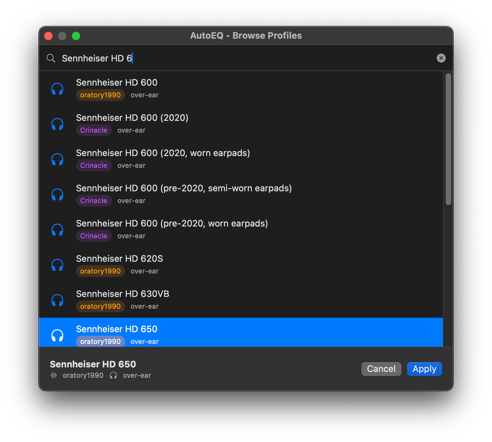

1. Type in **Search headphones...** to filter by manufacturer or model.
2. Each row shows the headphone, where the measurement came from (for example oratory1990 or Crinacle), and whether it is over-ear, in-ear or an earbud.
3. Select a row and click **Apply** (or press Return). Press Escape or click **Cancel** to close without applying.

Applying a profile sets the preamp of inputs 1 and 2 to the profile's value. It also writes the profile's filters into the PEQ bands of inputs 1 and 2 and sets the remaining bands to Off. Other channels are not touched. The change happens straight away and is unsaved until you save the preset. Connect the DSPi before applying a profile.

### Favourites

Hover a row in the browser and click the heart to add it to your favourites. Favourites appear under **AutoEQ > Favorite Profiles**, and choosing one applies it immediately. **Clear Favorites** removes them all.

### Updating the Database

Choose **AutoEQ > Update Database...**. The dialog shows the current database's date and number of entries, and offers:

- **Rebuild from GitHub** downloads every profile from the AutoEQ project and builds a fresh database. It needs an internet connection and can take several minutes, so Console asks you to confirm first. A progress window follows the download.
- **Import File...** loads an `autoeq_database.json` file, such as one rebuilt on another Mac.
- **Reset to Built-in** removes your updated copy and goes back to the database that came with Console. It appears only after you have updated.

---

## Tool Windows

The **Tools** menu opens a separate window for each processing feature and diagnostic. Changes made in these windows reach the device immediately and are stored with the active preset when you save it (see [Presets and Saving](#presets-and-saving)).

| Window | Shortcut | Also opened from |
|---|---|---|
| [Matrix Mixer](#matrix-mixer) | Cmd+Shift+M (opens or closes) | Sidebar button |
| [Loudness Compensation](#loudness-compensation) | Cmd+Shift+L | Right-click its sidebar button |
| [Headphone Crossfeed](#headphone-crossfeed) | Cmd+Shift+X | Right-click its sidebar button |
| [Psychoacoustic Bass](#psychoacoustic-bass) | Cmd+Shift+P | Right-click its sidebar button |
| [Subharmonic Synthesizer](#subharmonic-synthesizer) | Cmd+Shift+S | - |
| [Tube Modeller](#tube-modeller) | Cmd+Shift+D | - |
| [Stereo Upmixer](#stereo-upmixer) | Cmd+Shift+U | - |
| [Volume Leveller](#volume-leveller) | Cmd+Shift+V | Right-click its sidebar button |
| [Signal Generator](#signal-generator) | Cmd+Shift+G | - |
| [Spectrum Analyser](#spectrum-analyser) | Cmd+Shift+A | **Open in Window** on the RTA bar strip |
| [System Statistics](#system-statistics) (menu item "Stats for nerbs") | Cmd+Shift+T | Sidebar button |
| [Interrupt Monitor](#interrupt-monitor) | Cmd+Shift+I | - |

If a feature needs newer firmware than the board runs, its window says so and its controls are disabled.

### Common Tool Controls

The effect windows share the same kinds of control.

- **On/off switch**: every effect window has a switch at the top right that turns the whole effect on or off. For Crossfeed, Loudness, Leveller and Psychoacoustic Bass, this is the same switch as the sidebar button.
- **Parameter rows**: each row has a name, a value field with its unit, a slider, and often a short explanation underneath.
  - Drag the slider and the device follows live; the value is committed when you let go.
  - Click the number to type a value, then press Return.
  - Hold **Cmd** and scroll over the number to step it.
  - Values you type are kept within the row's range.
  - In the Subharmonic Synthesizer and Tube Modeller, hover a row to read a longer explanation.
- **Channel chips**: a row of numbered buttons chooses which outputs (or inputs) an effect applies to.
  - A filled chip is on and a grey chip is off. Click to toggle.
  - Hover a chip to see the channel's name.
  - The **Presets** menu above the chips sets them all at once.
- **Apply preset** menus fill in several parameters at once with a recommended starting point.
- **Graphs** in these windows are for display only; they update as you drag the sliders. When the effect is off, a graph shows **Disabled**.

All controls are disabled while no device is connected.

### Matrix Mixer

The Matrix Mixer is the routing patch bay. It decides which inputs feed which outputs, at what level and polarity. It also holds each output's enable, gain, delay and mute controls. Open it with **Cmd+Shift+M** or the sidebar button; the same shortcut closes it.

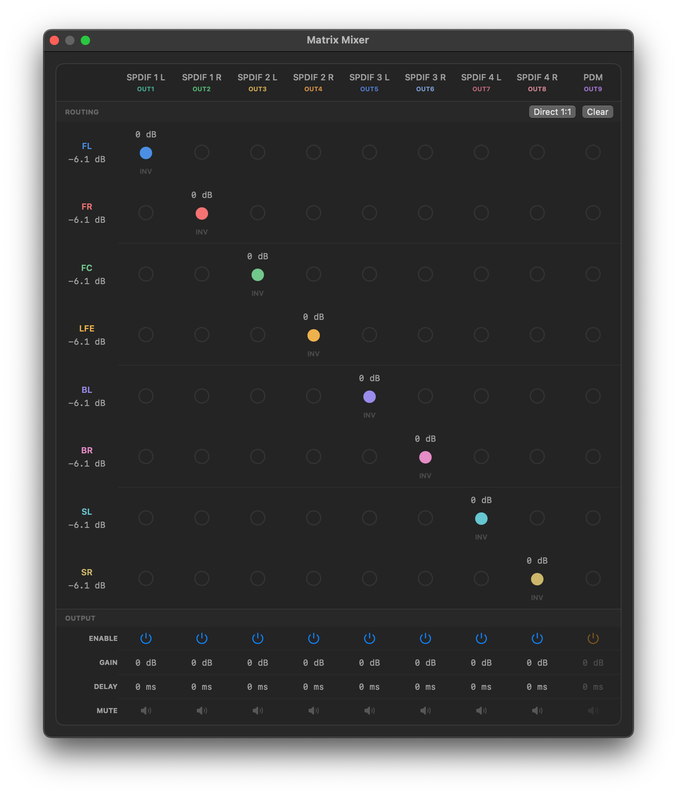

**Layout.** Each **column** is an output. The column header shows the output's name and its number (**OUT1**, **OUT2** and so on). Each **row** under **ROUTING** is an input:
- In stereo, the rows are **Input L** and **Input R**.
- With 4 to 8 inputs (RP2350), rows are labelled in surround order: **FL**, **FR**, **FC**, **LFE**, **BL**, **BR**, **SL**, **SR**. Hover a label for its full name.
- When the [Stereo Upmixer](#stereo-upmixer) is on, extra rows **C**, **Ls** and **Rs** appear for its derived channels.

The window resizes itself when the number of rows changes. With 8 inputs it can also be resized and scrolled.

**Crosspoints.** Each circle where a row meets a column is a crosspoint.
- **Click the circle** to connect that input to that output (a filled dot) or disconnect it (an empty ring).
- A connected crosspoint shows a **gain** field above the dot, from -60 to +12 dB. Use it to mix several inputs into one output without overloading it.
- A connected crosspoint also shows **INV** below the dot. Click it to invert the polarity of that route. It turns orange when inverted. Use it for a driver wired backwards, or to build a difference signal.

**Output rows.** Under **OUTPUT**, each column has four controls:

| Row | What it does |
|---|---|
| **ENABLE** | Turns the output on (blue) or off (grey). Disabling unused outputs saves processing power. Disabled outputs are greyed in the matrix and hidden from the sidebar. |
| **GAIN** | Output level, from -60 to +12 dB. This is the same value as GAIN on the output's channel page. |
| **DELAY** | Output delay in milliseconds, up to 42 ms (RP2040) or 85 ms (RP2350). Applied in whole milliseconds. |
| **MUTE** | Mutes the output (red speaker) or unmutes it. |

**The PDM subwoofer output shares a processor core** with the higher-numbered outputs: outputs 3 to 8 on the RP2350, or 3 and 4 on the RP2040. Only one side can run at a time. Enabling one side shows a warning that the other will be disabled. Choose **Enable PDM** or **Disable PDM** to confirm, or **Cancel**. An orange ENABLE button, or orange rings in the PDM column, mark where a conflict would occur.

**Editing the small fields.** Click a gain or delay field to type a value; the dB or ms unit is optional. You can also scroll over a field to adjust it, without holding Cmd.

**Column header menu.** Right-click an output's header for:
- **Identify**: plays a short tone on that output only (see [Channel List](#channel-list)).
- **Rename**: edits the output's name in place.
- **Copy Parameters** and **Paste Parameters**: see [Copying Channel Settings](#copying-channel-settings).

**Multichannel extras (RP2350 with 8-channel input).**
- A small **input trim** field under each row label sets that input's preamp, from -60 to +12 dB.
- **Direct 1:1** routes each input to the matching output (FL to OUT1, FR to OUT2 and so on) at 0 dB, clears every other route, and turns off PDM. A multichannel stream is silent until it is routed, so this is the quickest way to start.
- **Clear** disconnects every crosspoint. Each crosspoint's gain and polarity are kept, so reconnecting restores them.

### Loudness Compensation

Your ears hear less bass and treble at low volume. Loudness compensation adds back what quiet listening takes away, following the ISO 226 equal-loudness curves. The boost grows as you turn the volume down and vanishes at full reference level, so music keeps its tonal balance at any volume.

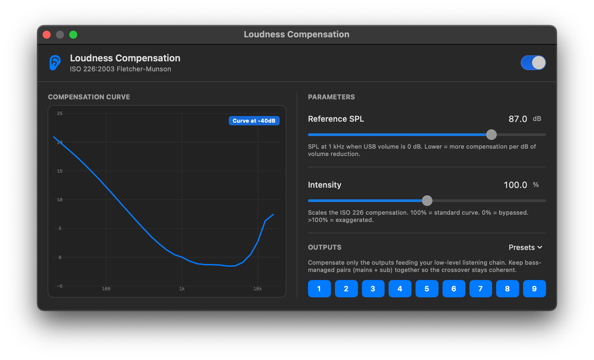

- **COMPENSATION CURVE** previews the boost at a volume setting of -40 dB. It doesn't follow the current volume.
- **Reference SPL** (40 to 100 dB, default 83) is the loudness of your system at 1 kHz with the volume at 0 dB. A lower value gives more compensation for each dB you turn down.
- **Intensity** (0 to 200%, default 100) scales the effect. 100% is the standard curve, 0% bypasses it, and values above 100% exaggerate it.
- **OUTPUTS** chooses which outputs are compensated. Use it to compensate only the outputs feeding your low-level listening chain. Keep a sub and its main speakers together so the crossover stays coherent. The presets are **All outputs**, **Slot 1 only (Headphones)** and **None**.

### Headphone Crossfeed

On headphones, each ear hears only its own channel, which can make hard-panned recordings sound unnaturally wide and tiring. Crossfeed blends a little of each channel, filtered and slightly delayed, into the other ear, the way you hear speakers in a room. Use it for headphones and leave it off for speakers.

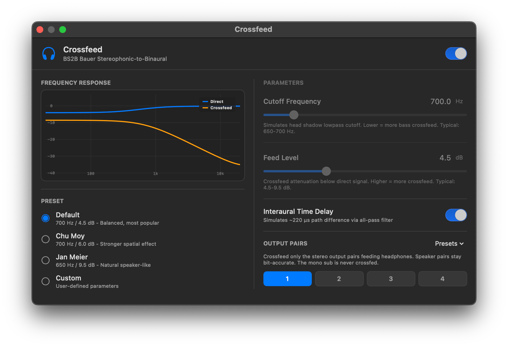

- **FREQUENCY RESPONSE** shows the **Direct** signal (what stays in the same ear) and the **Crossfeed** signal (what is fed to the other ear).
- **PRESET** offers three classic settings:
  - **Default**: 700 Hz, 4.5 dB, balanced.
  - **Chu Moy**: 700 Hz, 6.0 dB, a stronger effect.
  - **Jan Meier**: 650 Hz, 9.5 dB, natural and speaker-like.
  - **Custom**: your own values.
- **Cutoff Frequency** (500 to 2000 Hz) and **Feed Level** (0 to 15 dB) are the custom parameters. They are dimmed unless Custom is chosen, but changing either one switches to Custom automatically.
  - A lower cutoff crossfeeds more bass.
  - A higher Feed Level number means more crossfeed.
- **Interaural Time Delay** (on by default) adds the small difference in arrival time between your two ears.
- **OUTPUT PAIRS** chooses which stereo output pairs are crossfed. Speaker pairs stay untouched, and the mono sub is never crossfed. The default is pair 1 only. The presets are **All pairs**, **Pair 1 only (Headphones)** and **None**.

### Volume Leveller

The leveller evens out material that swings between quiet and loud. It gently lifts quiet passages rather than squashing loud peaks. Use it for late-night listening, films with quiet dialogue and loud effects, mixed playlists and podcasts.

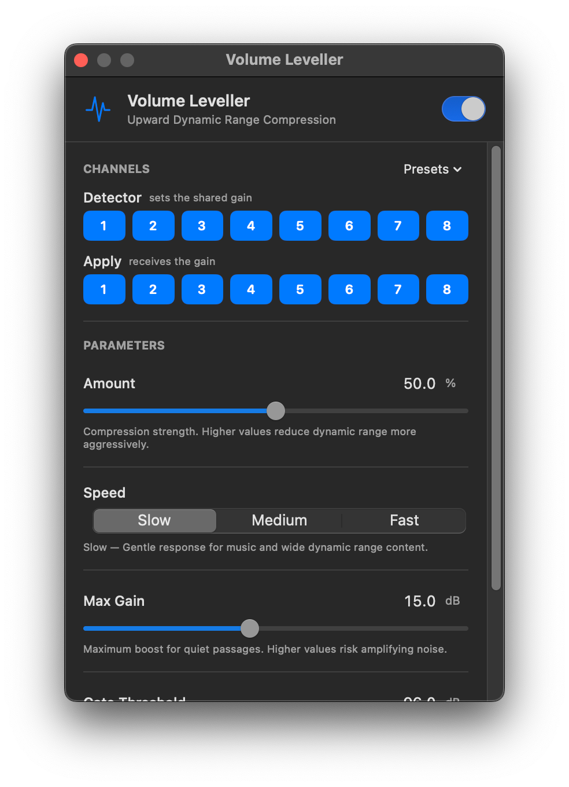

| Control | Range | Default | What it does |
|---|---|---|---|
| **Amount** | 0 to 100% | 50% | How strongly the dynamic range is reduced. |
| **Speed** | **Slow**, **Medium**, **Fast** | Slow | Slow suits music, Medium is general-purpose, and Fast suits speech and podcasts. |
| **Max Gain** | 0 to 35 dB | 15 dB | The largest boost given to quiet passages. Higher values risk amplifying noise. |
| **Gate Threshold** | -96 to 0 dB | -96 dB | Signals below this level are not boosted, so background noise isn't raised. |
| **Lookahead** | On or off | On | Adds 5 ms of delay so the leveller can react to sudden peaks cleanly. |

**CHANNELS** (with more than two inputs) chooses which inputs the leveller uses:
- **Detector** chooses which inputs are measured to decide the gain.
- **Apply** chooses which inputs receive the gain.
- The presets are **All channels (Night mode)**, **Center only (Dialog boost)** and **Front L / R only**. Center only raises film dialogue without pumping the effects.

### Psychoacoustic Bass

Small speakers can't reproduce the lowest notes. This effect generates harmonics of those notes, which the speaker *can* play, and your brain fills in the missing fundamental. The bass sounds deeper and fuller than the speaker can actually go. It can also cut the real sub-bass the speaker can't reproduce, which saves the driver's movement and the amplifier's headroom. Use it for small speakers, laptops and portable speakers, not for subwoofers.

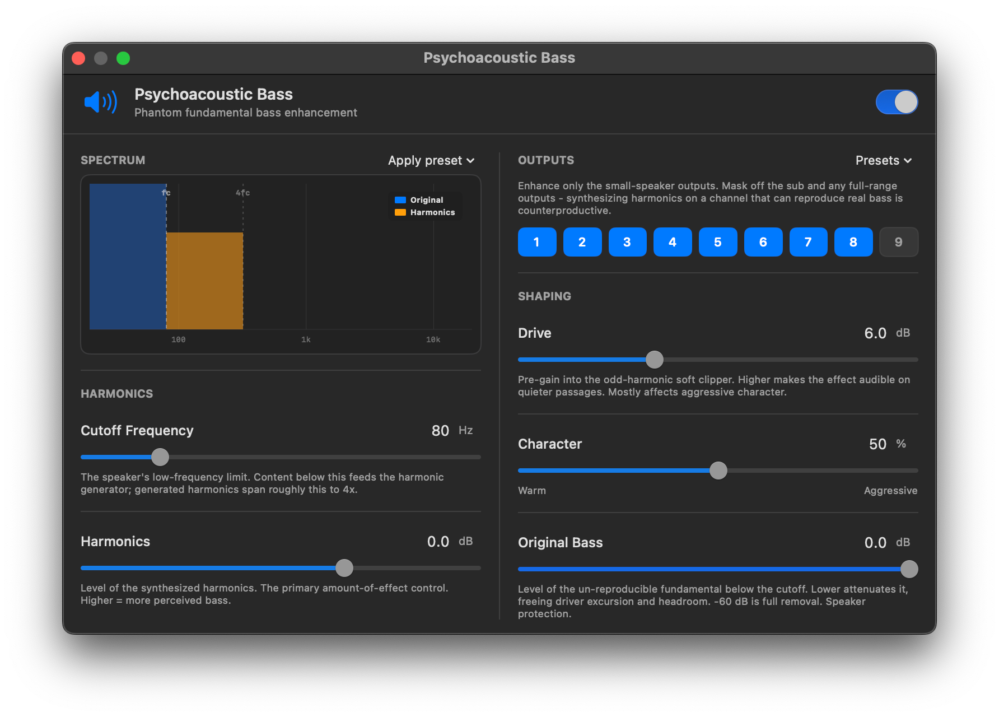

- **SPECTRUM** is a diagram of the effect, not a measurement.
  - **Original** is the bass below the cutoff.
  - **Harmonics** is the synthesised content between the cutoff (**fc**) and four times the cutoff (**4fc**).
- **Apply preset** offers **Bookshelf speakers**, **Small Bluetooth**, **Laptop / tablet** and **Headphone bass feel**. Each preset sets all five parameters.

| Control | Range | Default | What it does |
|---|---|---|---|
| **Cutoff Frequency** | 30 to 300 Hz | 80 Hz | The speaker's low-frequency limit. Content below this feeds the harmonic generator. |
| **Harmonics** | -24 to +12 dB | 0 dB | The level of the synthesised harmonics. This is the main amount-of-effect control. |
| **Drive** | 0 to 18 dB | 6 dB | Gain into the harmonic generator. Higher values make the effect audible on quieter passages. |
| **Character** | 0 to 100% | 50% | From **Warm** to **Aggressive**. |
| **Original Bass** | -60 to 0 dB | 0 dB | The level of the real bass below the cutoff. Lower it to protect the speaker; -60 dB removes it completely. |

**OUTPUTS** chooses which outputs get the effect. The presets are **All outputs**, **Exclude sub (recommended)** and **None**. Adding harmonics to a channel that can already play real bass is counterproductive.

### Subharmonic Synthesizer

This is the opposite of psychoacoustic bass. Instead of implying a low note, it creates a **real** one, an octave below the bass already in the music, like the classic dbx subharmonic synthesizers. Only use it on outputs that can reproduce 24 to 80 Hz, such as a subwoofer.

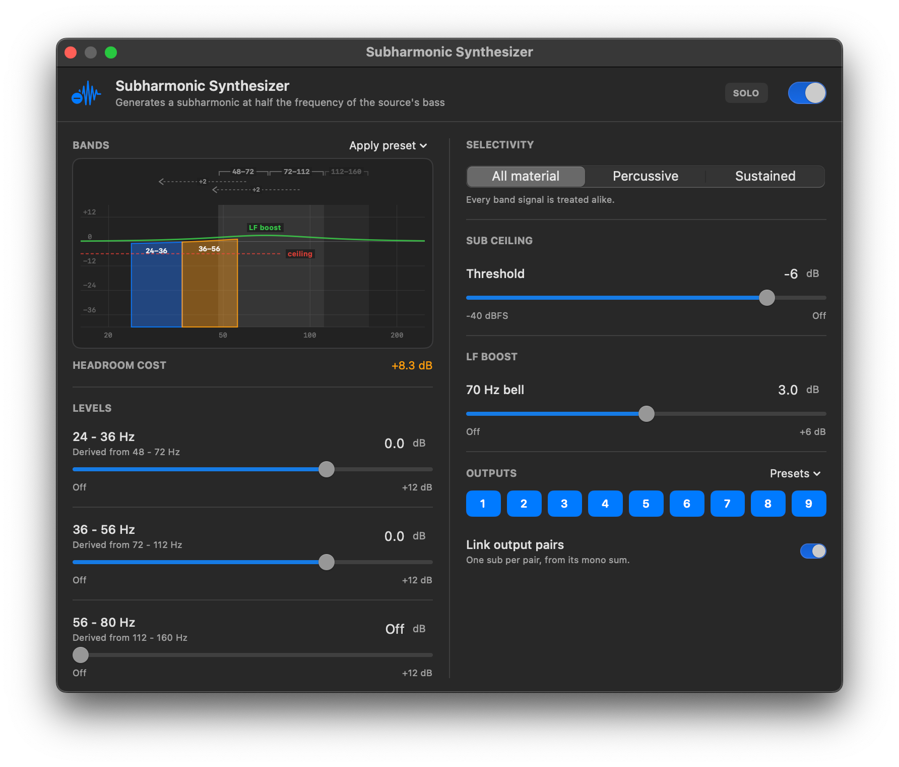

It works in three independent bands. Each listens to a slice of the music's bass and adds a note at half its frequency:

| Band | Listens to | Default |
|---|---|---|
| **24 - 36 Hz** | 48 - 72 Hz | 0 dB |
| **36 - 56 Hz** | 72 - 112 Hz | 0 dB |
| **56 - 80 Hz** | 112 - 160 Hz | Off |

Each band's level runs from **Off** (-30 dB) to +12 dB. The top band ships off, because in that range a synthesised note starts to compete with the music's own bass. Turn it up for a subwoofer that can't reach the lowest octave.

- **BANDS** graph: shaded columns show the bands being listened to. Coloured blocks show the synthesised notes, and dashed "÷2" arrows link each pair. It also shows the LF boost curve and the sub ceiling line.
- **Apply preset**: **Subwoofer feed**, **Club / large PA**, **Thin recordings** and **Cinema LFE**.
- **HEADROOM COST** shows the most gain your settings can add, for example **+4.2 dB**. Lower the preamp on the inputs feeding the selected outputs by that much, or loud passages will clip.
- **SELECTIVITY** chooses what material gets a sub:
  - **All material** (the default) treats everything alike.
  - **Percussive** adds a short sub burst after each attack. It extends kicks but not bass lines.
  - **Sustained** adds sub only once a note has been ringing. It extends bass notes but not kicks.
  - For Percussive and Sustained, **Depth** (0 to 100%) sets how strongly the unfavoured material is held back. **Hold** (50 to 400 ms) sets the length of the burst (Percussive), or how long a note must ring before its sub opens (Sustained).
- **SUB CEILING**: **Threshold** (-40 dBFS to **Off**) is a soft limiter on the synthesised sub alone. It caps how hard the sub can push a driver without touching the music. With it on, the headroom cost is limited to the ceiling.
- **LF BOOST**: **70 Hz bell** (Off to +6 dB) is a gentle boost at 70 Hz that fills the gap between the sub and the music's own mid-bass.
- **OUTPUTS**: the presets are **Sub only (recommended)**, **All outputs** and **None**.
  - The effect runs before the crossover, so a satellite speaker with a high-pass filter throws the sub away again. Mask such outputs off to save processing power.
  - A thin meter under each chip shows the level of the synthesised sub alone.
- **Link output pairs** (on by default) makes one sub per output pair from the pair's mono sum. This stops two separate sub-generators from cancelling each other between the speakers.
- **SOLO** (header button) mutes the music on the selected outputs, so you can hear or measure the synthesised sub on its own. It turns off automatically when you close the window, and it is never saved.

### Tube Modeller

The Tube Modeller adds the character of a valve (vacuum tube) amplifier: tube-shaped harmonic distortion, the gentle compression of a sagging power supply, and optionally the loose grip a tube amp has on a speaker. It runs on the selected outputs before the crossover and output EQ, where a real preamp would sit. The defaults are nearly transparent, so switching it on doesn't change the level.

The tube icon in the header glows while the effect is on. The **Basic | Advanced** switch changes only how many controls you see, never the sound.

**Basic mode**

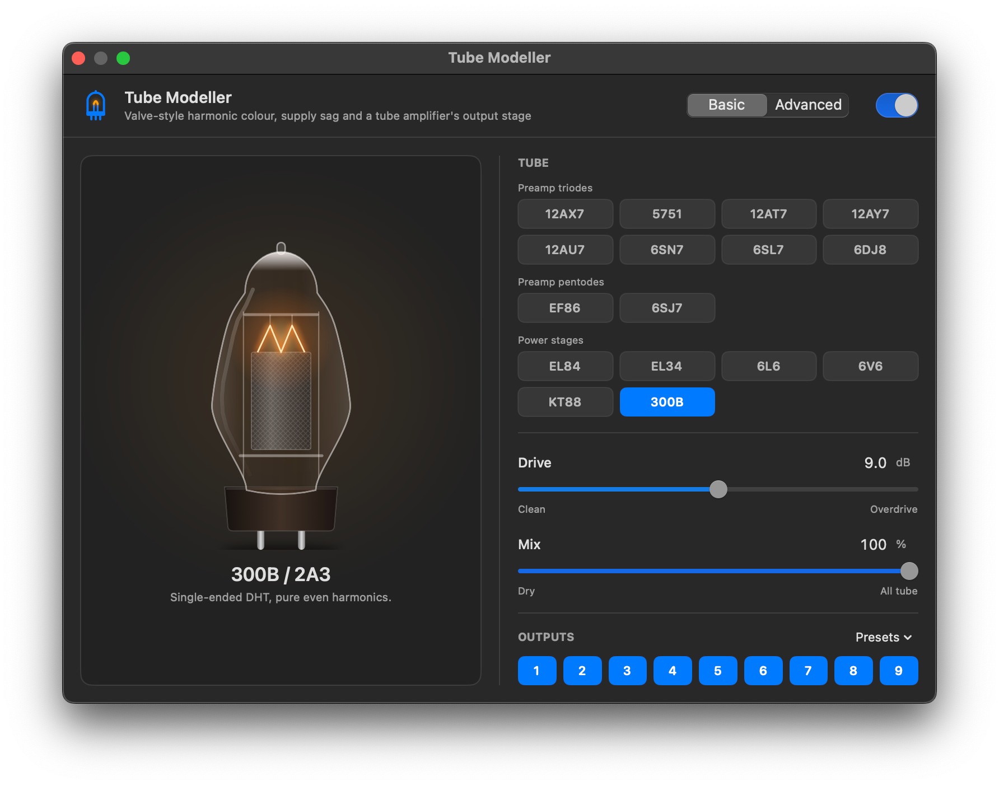

- The **showcase** on the left draws the selected tube, and it glows in time with the music on the chosen outputs.
- The **TUBE** shelf offers one-click tube types in three groups: **Preamp triodes**, **Preamp pentodes** and **Power stages**. Hover a tube for its description. Picking a tube loads its character (bias, asymmetry, knee hardness and sag) and leaves the other settings alone.
- **Drive** (-6 to +24 dB, from **Clean** to **Overdrive**, default -6 dB) sets how hard the tube is driven. A few dB gives warmth, and a lot gives overdrive.
- **Mix** (0 to 100%, from **Dry** to **All tube**, default 100%) blends the tube with the untouched signal. Mixing below 100% is the easiest way to use heavy drive subtly.

The available tubes are:
- Preamp triodes: 12AX7 / ECC83 (the default), 5751, 12AT7 / ECC81, 12AY7, 12AU7 / ECC82, 6SN7, 6SL7 and 6DJ8 / ECC88 / 6922.
- Preamp pentodes: EF86 / 6267 and 6SJ7.
- Power stages: EL84 / 6BQ5, EL34, 6L6 / 5881, 6V6, KT88 / 6550 and 300B / 2A3.

Push-pull power tubes are meant to be used with the output stage on, which is in Advanced mode.

**Advanced mode**

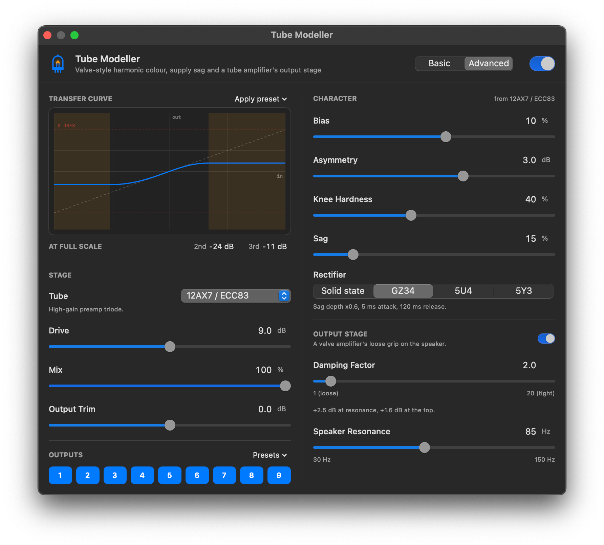

- **TRANSFER CURVE** plots output against input for one full-scale swing.
  - The dashed diagonal is a clean, unaltered signal.
  - Orange areas show where the signal is pushed past the tube's knee, which is where harmonics come from.
  - Red lines mark 0 dBFS.
  - **AT FULL SCALE** gives the 2nd and 3rd harmonic levels.
- **Apply preset** offers **Clean default**, **Warm hi-fi**, **Single-ended sweetness**, **Guitar-amp style** and **Push-pull power**. Each preset also resets Mix to 100% and Output Trim to 0 dB.
- **STAGE**:
  - **Tube** chooses the tube type, or **Custom**. Editing any character control switches it to Custom.
  - **Drive** and **Mix** work as in Basic mode.
  - **Output Trim** (-12 to +12 dB) sets the level of the processed signal. Heavy, asymmetric settings can push it above full scale, so watch the clip indicators and trim it back here.
- **CHARACTER**:
  - **Bias** (-100 to +100%) adds the warm 2nd harmonic.
  - **Asymmetry** (-12 to +12 dB) adds even-order content at heavy drive.
  - **Knee Hardness** (0 to 100%) sets how abruptly the tube saturates.
  - **Sag** (0 to 100%) is power-supply compression under sustained drive.
  - **Rectifier** is **Solid state** (no sag), **GZ34**, **5U4** or **5Y3**. The valve rectifiers become progressively softer and slower in that order.
- **OUTPUT STAGE** (off by default) imitates a tube amp's loose grip on the speaker: a broad bump at the woofer's resonance and a small lift at the top.
  - **Damping Factor** runs from 1 (loose) to 20 (tight). A single-ended triode is about 2 to 3; a push-pull amp with feedback is about 8 to 15.
  - **Speaker Resonance** is 30 to 150 Hz.
  - A readout shows the resulting bump and lift.
- **OUTPUTS** (both modes): the presets are **All outputs**, **Exclude sub** and **None**.

### Stereo Upmixer

*RP2350 only.* The upmixer derives a **Centre** channel and **Left and Right Surround** channels from ordinary stereo. It uses what the stereo pair already contains and invents nothing. It runs on stereo input at 48 kHz or below.

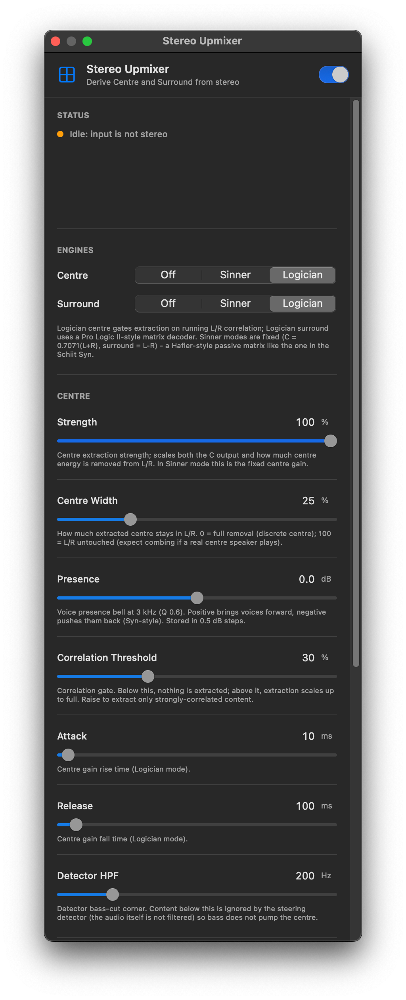

The derived channels are not sent anywhere automatically. They appear as extra rows **C**, **Ls** and **Rs** in the [Matrix Mixer](#matrix-mixer), where you route them to your centre and rear outputs. A centre crosspoint gain of -3 dB is a safe start, because the centre row can reach +3 dBFS.

- **STATUS** shows whether the upmixer is active or why it is idle (for example "input is not stereo" or "sample rate above 48 kHz"). While active, live meters show:
  - **Correlation**: how similar left and right are, from -1 to +1.
  - **Centre gain**: how much centre is being extracted.
  - **Ls gain** and **Rs gain**: surround steering.
- **ENGINES**: **Centre** and **Surround** can each be **Off**, **Sinner** or **Logician**.
  - **Sinner** is a fixed passive matrix, like the one in the Schiit Syn.
  - **Logician** is adaptive: it steers according to the music, like a Pro Logic II decoder.
- **CENTRE** (hidden when Centre is Off):
  - **Strength** (0 to 100%): how much centre is extracted.
  - **Centre Width** (0 to 100%): how much of the centre stays in the left and right channels. 0 removes it fully.
  - **Presence** (-12 to +12 dB): a voice-presence boost or cut at 3 kHz.
  - In Logician mode only:
    - **Correlation Threshold** (0 to 95%): below this, nothing is extracted.
    - **Attack** (1 to 500 ms) and **Release** (5 to 2000 ms).
    - **Detector HPF** (20 to 1000 Hz): keeps bass from making the centre pump.
- **SURROUND** (hidden when Surround is Off):
  - **Delay** (0 to 20 ms): a delay on the surrounds. A rule of thumb is about 1 ms per foot of listener distance.
  - **Band-limit HPF** (20 to 2000 Hz) and **Band-limit LPF** (1 to 20 kHz): shape the surround content. 7 kHz is the classic surround voicing.
  - **Decorrelation** (0 to 100%): widens the rear image.

### Signal Generator

The Signal Generator plays test and measurement signals generated on the DSPi itself, so no music source is needed. Use it to check wiring, identify channels, set levels and measure a room.

> **Start quiet.** Test signals are steady and dense. They drive speakers much harder than music at the same meter level. The default level is -20 dBFS; raise it gradually.

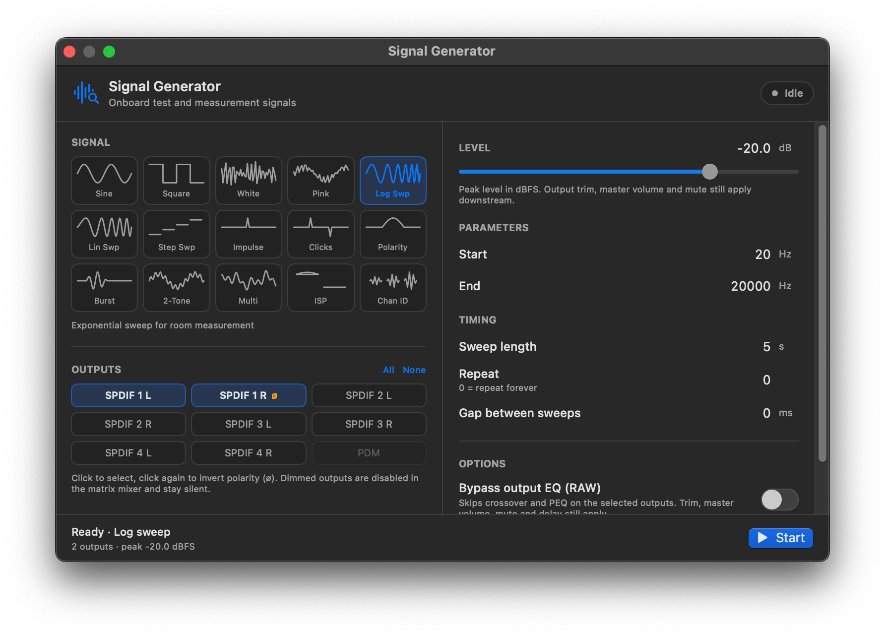

**SIGNAL.** Click a tile to choose a signal. Choosing a signal resets its parameters to their defaults.

| Tile | Signal | Use |
|---|---|---|
| Sine | Pure tone | Level checks, distortion tests |
| Square | Band-limited square wave | Polarity and response checks |
| White | White noise | Broadband testing |
| Pink | Pink noise (-3 dB/oct) | Level matching and room response |
| Log Swp | Logarithmic sweep | Room measurement |
| Lin Swp | Linear sweep | Frequency response |
| Step Swp | Stepped sweep | Discrete tones stepping up the band |
| Impulse | Single-sample impulses | Timing and alignment |
| Clicks | Clicks of alternating polarity | Timing checks |
| Polarity | Positive half-sine pulse | Checking driver polarity |
| Burst | Tone bursts | Transient response |
| 2-Tone | Tone pair | Intermodulation distortion tests (SMPTE / CCIF) |
| Multi | Multitone | Fast response and distortion checks |
| ISP | Inter-sample peak test | Checking whether a DAC clips on inter-sample peaks |
| Chan ID | Channel ID | Each output plays its channel number as counted blips |

**OUTPUTS.** Click an output chip to select it. Click again to invert its polarity (it shows **ø**), and a third time to deselect it. **All** and **None** select every output or none. A dimmed chip is an output that is disabled in the Matrix Mixer, so it stays silent.

**LEVEL** sets the peak level in dBFS. You can type a value between -120 and 0 dBFS; the slider covers -80 to 0. Output trim, master volume and mute still apply after the generator.

**PARAMETERS** shows the chosen signal's settings, such as frequency, sweep range, steps per octave, period and cycle counts. Type values, or Cmd-scroll to step them.
- **2-Tone** has **SMPTE 60/7k** and **CCIF 19k/20k** preset buttons.
- **ISP** chooses between two test patterns with known inter-sample peaks: **fs/4 · +3.01 dBTP** and **fs/6 · +1.25 dBTP**.

**TIMING** depends on the signal:
- **Sweeps**: **Sweep length**, **Repeat** (0 repeats forever) and **Gap between sweeps**.
- **Repeating patterns**: **Repeat** and **Extra gap per period**.
- **Continuous signals**: **Duration** (0 plays until stopped), or **Dwell per channel** and **Passes** when walking outputs.

**OPTIONS**:
- **Bypass output EQ (RAW)** skips the crossover and PEQ on the selected outputs. Take care: a tweeter output then receives full-range signal with no crossover protection.
- **Decorrelate channels** (white and pink noise) sends independent noise to each output instead of copies of one signal.
- **Walk outputs one at a time** plays the selected outputs in turn instead of together. The chip currently playing gets a green outline. Channel ID always walks.

**Transport.**
- **Start** begins playback, and **Stop** fades it out. The small stop icon stops it at once, with no fade. The **Space bar** also starts and stops.
- The status pill shows **Idle**, **Fading in**, **Running**, **Gap** or **Fading out**.
- If something prevents starting, the transport line explains why (for example "Select at least one output").
- Changes made while running are applied live.

**The generator keeps playing after you close its window**, which is handy during long measurements. To stop it, reopen the window and click **Stop**, or load a preset.

### Spectrum Analyser

The Spectrum Analyser window shows the device's live spectrum measurement in a large view.

The DSPi has one analyser, which measures either inputs or outputs. The window mirrors whatever the main window's current page is showing. To change which channels are measured, use the gear on the response graph (see [Graph Options](#graph-options)).

- The **header** shows the page ("Dashboard" or the channel page), the side (Inputs or Outputs), and each measured channel. Click a channel name to hide or show it **in this window only**.
- **Curves | Bars | Both** chooses how the spectrum is drawn here. It doesn't change the main window.
  - **Curves** is the same filled spectrum as the response graph.
  - **Bars** shows third-octave bars, one cell per channel, arranged in the number of columns chosen on the RTA bar strip. With **Peak Hold** on, a thin cap marks each bar's recent maximum.
- The **status bar** shows whether the analyser is running, how often each channel is refreshed, frames per second, and processing time. If low bands are missing from the bars, it suggests a larger **Transform Size** in [Spectrum Analyser Settings](#spectrum-analyser-settings).

Closing, minimising or covering the window stops it drawing, and the analyser stops altogether when nothing else is showing it.

### System Statistics

**Tools > Stats for nerbs** (Cmd+Shift+T), or the info button in the sidebar, opens **System Statistics**. It is a read-only view of how the device is running. It is most useful for tracking down clicks, dropouts and clock problems. Counters and status refresh every 2 seconds.

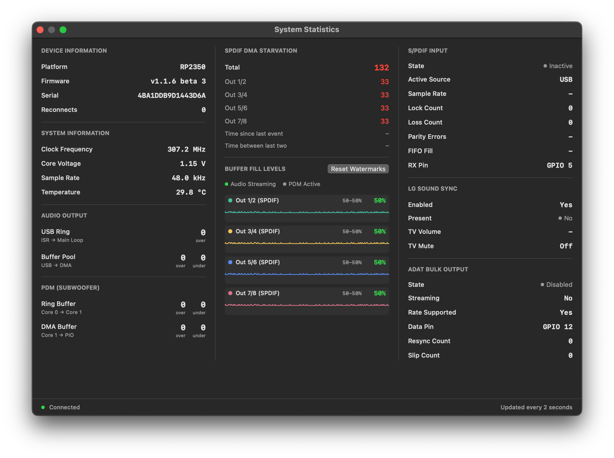

- **DEVICE INFORMATION**: platform, firmware version, serial number and reconnect count.
- **SYSTEM INFORMATION**: clock frequency, core voltage, sample rate and chip temperature.
- **AUDIO OUTPUT** and **PDM (SUBWOOFER)**: counts of buffer overruns (data arriving too fast, orange) and underruns (too slow, red). Counts that keep rising point to a clock mismatch or an overloaded processor.
- **SPDIF DMA STARVATION**: how often an output ran out of audio, which you hear as a click or dropout. It shows a total, a count per output pair, and the time since the last event and between the last two.
- **BUFFER FILL LEVELS**: how full each output buffer is, with a 15-second trace, a shaded minimum-to-maximum band and the current figure.
  - Green is healthy, yellow is drifting and red is empty or full.
  - **Reset Watermarks** clears the recorded minimum and maximum.
  - **Audio Streaming** and **PDM Active** show whether audio is flowing.
- These sections appear only when they apply:
  - **S/PDIF INPUT**: lock state, source, sample rate, lock and loss counts, parity errors, receive pin, and the incoming stream's channel status (format, audio type, category, word length, copy permission). The **DEBUG** lines under it are receiver internals, intended for developers.
  - **LG SOUND SYNC**: whether an LG TV's volume data is detected, with the TV's volume and mute state.
  - **ADAT BULK OUTPUT**: state, data pin, and resync and slip counts. The slip count should stay at 0.
  - **I2S INPUT (SLAVE CLOCK)**: lock state, and the detected and measured sample rates.

### Interrupt Monitor

**Tools > Interrupt Monitor...** (Cmd+Shift+I) opens a scrolling log of the notification messages the device sends to Console, for example when a parameter changes on the device. It is a diagnostic tool, mainly useful when reporting a problem. **Pause** or **Resume** freezes the log, and **Clear** empties it. The header shows whether it is **Listening** and how many events it has recorded.

---

## Settings

### Opening and Navigating Settings

Open Settings with **DSPi Console > Settings...** (**Cmd+,**) or the gear button in the sidebar. The gear button also closes the window.

The sidebar groups the pages:

| Group | Pages |
|---|---|
| **Application** | [About](#about), [Advanced](#advanced) |
| **Display** | [Graphing](#graphing), [Spectrum Analyser](#spectrum-analyser-settings) |
| **System** | [Overview](#pin-overview), [Inputs](#inputs), [Outputs](#outputs), [I2S Configuration](#i2s-configuration), [Global Parameters](#global-parameters) |
| **Control** | [Control Surfaces](#control-surfaces), [Control Interfaces](#control-interfaces), [Channel Groups](#channel-groups), [Macros](#macros), [Auxiliary Outputs](#auxiliary-outputs) |

A page appears only when the connected device supports it. The **Back** and **Forward** arrows in the title bar move through the pages you have visited, like a web browser. Settings reopens on the last page you used.

### The Settings Save Bar

When Settings holds changes that are not yet stored on the device, a bar appears at the bottom of the window. It reads **Unsaved changes**, with the note "Saving writes these settings to the device's flash".

- **Save** (or Return) writes the pending changes to the device's flash memory.
- **Revert** discards them and puts the device back as it was.

The bar stays in place as you move between pages, and it survives closing and reopening the window. If you switch to a different DSPi, pending changes are discarded after a warning.

Different pages use the bar in different ways:

- **[Global Parameters](#global-parameters)**: edits are held as a draft and are not sent to the device until you click **Save**.
- **[Inputs](#inputs), [Outputs](#outputs), [I2S Configuration](#i2s-configuration)** and the [output limiters](#output-limiter): changes apply to the device immediately so you can test them.
  - In **Independent** hardware mode, **Save** stores them on the board, and **Revert** restores the wiring you started from.
  - In **With Preset** hardware mode, the bar doesn't appear for these pages. Save the preset instead.
- **[Control Surfaces](#control-surfaces)** and its related pages: controls you **Apply** are live immediately. **Save** keeps them across a restart.
- **[Control Interfaces](#control-interfaces)** has its own **Apply** buttons and doesn't use the bar.

### About

The About page shows Console's version and links to the Weeb Labs YouTube, GitHub, Discord, Patreon and Ko-fi pages. DSPi and Console are free, open-source projects, and contributions are welcome.

### Advanced

- **Channel Names > Reset** sets every channel name back to its default ("USB L", "USB R", "SPDIF 1 L" and so on) immediately, without confirmation.
- **Diagnostics > Show Debug Information** reveals a developer section for testing Console's first-run experience. You don't need it for normal use.

### Graphing

The Graphing page holds the same settings as [Graph Setup](#graph-setup), plus a few more. All of them are preferences on your Mac and take effect immediately.

| Setting | Default | What it does |
|---|---|---|
| **Graph Line Glow** | On | A neon glow on the response curves. |
| **Show Phase Response** | Off | Draws the selected channel's phase as a dotted line. |
| **Unwrap Phase** | Off | Shows phase as a continuous line instead of wrapping at ±180°. Needs Show Phase Response. |
| **Line Width** | 2.0 pt | 1 to 4 pt. |
| **Animation Speed** | 0.20 s | 0.10 to 0.50 s. How long curve changes take to animate. |
| **Show Frequency Grid**, **Show Frequency Labels**, **Show dB Grid**, **Show dB Labels** | On | Grid lines and axis labels. |
| **Grid Opacity** | 50% | 0 to 200%. |
| **Vertical Range** | 50 dB | 10 to 100 dB. |
| **Center** | 0 dB | -40 to +20 dB. The label shows the resulting top and bottom of the graph. |
| **Min Frequency** / **Max Frequency** | 15 Hz / 20 kHz | 10 to 100 Hz / 5 to 20 kHz. |
| **Pop-out graph follows channel selection** | On | See [Pop-Out Graph Window](#pop-out-graph-window). |

### Spectrum Analyser Settings

These settings control how the live spectrum looks and how the device measures it. They apply to the graph overlay, the RTA bars and the [Spectrum Analyser](#spectrum-analyser) window. The channels to measure are chosen from the graph's gear, not here.

**Display**
- **Spectrum Strength** (30 to 100%, default 100%): how strongly the spectrum fill shows behind the response curves.
- **Peak Hold** (on): a cap above each band marking its recent maximum.
- **Smoothing** (on): glides the display between measurements. It helps most with several channels, where each refreshes less often.

**Vertical Scale**
- **Floor**: -60, -90 (the default) or -120 dB.
- **Ceiling**: 0, +6 (the default) or +12 dBFS. The extra headroom above full scale is there because EQ boosts and upmixed channels can legitimately exceed 0 dBFS.

**Engine** (sent to the device)
- **Transform Size**: 256, 512 or 1024 points (the default is 1024). More points resolve lower frequencies, but each channel refreshes less often.
- **Averaging**: Off, 50 ms, 125 ms, 300 ms (the default), 1 s or 3 s. Longer averaging gives a steadier display that reacts more slowly.
- **Peak Decay**: Off, 4, 12 (the default) or 30 dB/s. How fast peak caps fall. It needs Peak Hold.

The footer reports the connected device's usable range and largest transform, or says if its firmware has no analyser.

### Pin Overview

**System > Overview** is a map of the board's GPIO pins and what each one is used for. It is read-only. Use it to find free pins before you wire something new.

- The summary shows how many of the 26 usable GPIOs are in use and how many are free.
- The pin map shows every usable GPIO in order, coloured by role, with free pins in grey. Hover a pin to see its owner. This makes it easy to spot a free adjacent pair, which clock pins need.
- The pins are then listed under **Outputs**, **Clocks**, **Inputs**, **Control** and **Other**.

Only pins that are actually in use are shown. For example, a disabled optional input or an inactive control reserves nothing. Throughout Settings, pin menus offer only free pins, so two functions can't be given the same pin by mistake.

### Inputs

**System > Inputs** configures the digital inputs. The input *source* itself is chosen in the sidebar's [Source](#input-source-picker) menu. Changes apply immediately. A status line at the bottom reports the result of your last change.

**S/PDIF Input**
- **Instances** (on firmware with multiple S/PDIF inputs) chooses how many selectable S/PDIF inputs share the one receiver: up to 3 or 4. Input 1 is always on. Before reducing the count, switch the input source away from any input that would be removed.
- One pin row per input (**S/PDIF 1**, **S/PDIF 2** and so on, or **SPDIF RX** on older firmware) chooses the GPIO connected to your optical (TOSLINK) receiver module or comparator. The defaults are GPIO 5, 20, 21 and 22.
- **LG Sound Sync** decodes the volume and mute signals an LG TV sends over optical, and applies them as the volume. Your TV remote then controls the volume. This setting is stored with each preset.

**I2S Input** (on firmware that supports it)
- **Clock Mode**: **Master** means the DSPi generates the clocks and the source must follow. **Slave** means an external device drives the clocks and the DSPi detects the rate automatically.
  - Clock Mode only takes effect while I2S is the input source.
  - If any output is I2S, Console warns before you change it. Switching may make a connected DAC emit loud noise if its wiring doesn't suit the new mode.
- **Lock Status** (in Slave mode, with I2S selected) shows **Locked**, **Acquiring**, **Relocking** or **Inactive**, and the measured rate.
- **Channels**: 2, 4, 6 or 8 channels (RP2350), carried as stereo pairs. The RP2040 always uses 2.
- **Serial Data 1** to **4**: the GPIO carrying each stereo pair's data. The defaults are GPIO 4, 16, 17 and 18.
- The shared bit clock pin and the sample rate are set in [I2S Configuration](#i2s-configuration).

**ADAT Input** (RP2350)
- **Enable ADAT Input** receives 8 channels of 24-bit audio at 44.1 or 48 kHz over one optical cable. Assign a **Serial Data** pin first; there is no default. Then choose ADAT as the source.
- **Clock Mode**:
  - **Master**: the DSPi owns the sample rate (set in [I2S Configuration](#i2s-configuration)), and the source syncs to the DSPi's ADAT output.
  - **Slave**: the source owns the clock and the rate is detected.
- If ADAT input is enabled in Master mode while ADAT output is off, a **Clock is free-running** warning appears. You will hear periodic glitches. Click **Enable ADAT Output** and connect it to the source's ADAT input, or switch to Slave mode.
- **Lock Status** shows **Locked**, **Syncing**, **Acquiring**, **Relocking** or **Inactive** while ADAT is the source.
- A typical use is an 8-channel converter such as a Behringer ADA8200. Its channels arrive as inputs 1 to 8, each with full EQ and metering.

### Outputs

**System > Outputs** configures the physical outputs. Changes apply immediately.

**Slots.** Each stereo output slot has its own row. The RP2040 has **OUT 1/2** and **OUT 3/4**; the RP2350 also has **OUT 5/6** and **OUT 7/8**. The **Sub** row is the PDM subwoofer output. A **Default** tag marks a slot whose type and pin are unchanged from the factory settings.
- **Type**: **S/PDIF** (a digital optical or coaxial stream) or **I2S** (a direct connection to a DAC chip). The Sub is always **PDM**, a one-bit stream that a simple filter turns into analogue.
- **Pin**: the GPIO for the output's data. The defaults are GPIO 6, 7, 8 and 9 for the slots and GPIO 10 for the Sub.

**Bulk Output** (RP2350)
- **Enable ADAT** streams all 8 output channels over one optical ADAT cable at 44.1 or 48 kHz, alongside the other outputs. Drive a TOSLINK transmitter from the **Serial Data** pin (default GPIO 12).

**Reset Pins** sets every output pin back to its default. It doesn't change output types.

### I2S Configuration

**System > I2S Configuration** sets the clocks shared by I2S outputs and I2S input. Changes apply immediately.

| Setting | What it does |
|---|---|
| **BCK Pin** | The bit clock pin. The word clock (LRCK) is always the next GPIO up. The default is GPIO 14. You can only change it while no output is set to I2S. |
| **Clock Pins** | **Unified**: master and slave modes share the same clock pins. **Split**: slave mode uses separate pins. |
| **Slave BCK Pin** | In Split mode, the clock pins used in slave mode (the next GPIO is LRCK). |
| **Master Clock (MCK)** | Outputs a master clock for DACs that need one. It is forced off in I2S slave mode. |
| **MCK Pin** | GPIO 21 on the RP2040; GPIO 13, 15 or 21 on the RP2350. Turn MCK off before changing it. |
| **MCK Multiplier** | **128x** or **256x** the sample rate. It is locked to 128x at 96 kHz and above. |
| **Input Sample Rate** | **44.1 kHz**, **48 kHz** or **96 kHz** for I2S input in master mode. In slave mode the external device sets the rate. |

### Global Parameters

**System > Global Parameters** holds board-wide settings that don't belong to any preset. Edits here are a draft until you click **Save** in the [save bar](#the-settings-save-bar).

**Startup Preset** chooses which preset the board loads at power-on.
- **Specified Default** always loads the preset chosen in **Default Preset**.
- **Last Used** loads whichever preset was active last.

**External Mute Control** can briefly mute an external DAC or amplifier during events that could cause a pop, such as sample-rate changes. It appears with firmware that supports it.
> **Adjust only with audio stopped.** Changing these settings during playback can send a loud pop to your speakers.
- **Enable Automatic Mute** turns the feature on. Console picks a free pin if none is set.
- **Polarity**: **Active Low** or **Active High**, to match your DAC's mute input.
- **Mute Pin**: the GPIO wired to the mute input.
- **Hold Time** (5 to 100 ms): how long the mute is held before the clock stops.
- **Release Time** (0 to 100 ms): how long to wait after unmuting before audio resumes.
- **Test > Start** pulses the mute line for one second so you can check the wiring. Save your changes first.

**Master Volume** mode:
- **Independent**: master volume is stored once on the board and applied at power-on. Loading a preset never changes it. Save it with **File > Save Master Volume**.
- **With Preset**: master volume is part of each preset.

**Hardware Configuration** mode:
- **Independent**: pins, output types, clocks, input configuration, ADAT and output limiters are stored once for the board. Loading a preset never changes your wiring. Choose this when your hardware is fixed.
- **With Preset**: the hardware configuration is part of each preset and changes when you load one.

### Control Interfaces

**Control > Control Interfaces** lets another device, such as a microcontroller, home-automation controller or custom front panel, control the DSPi over a serial link. It appears with firmware that supports it. Both interfaces are off by default. They can only be configured from Console over USB. Their settings survive a factory reset.

**UART** (a 3.3 V serial link, 8N1 framing)
- **Enable UART** switches it on.
- **TX Pin** (default GPIO 16) and **RX Pin** (default GPIO 17). The pin menus only offer pins that can do the job.
- **Baud Rate**: 9600 to 1000000 (1000k); it must match the controller. The default is 115200.
- **Push Notifications** sends live changes to the controller as they happen, instead of the controller having to poll.

**I2C** (the DSPi acts as an I2C target; the controller is the bus master)
- **Enable I2C Target** switches it on.
- **SDA Pin** (an even GPIO, default 18) and **SCL Pin** (the next odd GPIO, default 19).
- **Target Address**: 0x08 to 0x77, default 0x42.
- Fit 2.2 kΩ to 4.7 kΩ pull-up resistors on the I2C bus.

Each interface shows a status: **Active** (running), **Inactive** (enabled but not running, usually because a pin clashes with other wiring), or **Disabled**.

Edits are held until you click **Apply** on that interface. Apply checks the settings, activates them and saves them in one step. **Revert** discards edits you haven't applied. If Apply fails, a message explains why, for example that a pin is already in use. The protocol itself is documented in the firmware repository.

---

## Control Surfaces

Control Surfaces let you wire physical controls to spare GPIO pins on the board and bind each one to a device function. The controls can be buttons, switches, knobs, rotary encoders, LEDs, an IR remote receiver or a small display. For example, you can build a volume knob, a mute button with a status LED, an input selector, or a remote-controlled amplifier trigger. The controls work on their own, without Console running.

Control Surfaces live in the **Control** group of the [Settings](#settings) window, across four pages:

- **Control Surfaces** holds your controls, the IR remote and the display.
- **[Channel Groups](#channel-groups)** holds named sets of channels that one control can drive together.
- **[Macros](#macros)** holds sequences of changes fired by one press.
- **[Auxiliary Outputs](#auxiliary-outputs)** holds pins that switch or dim external equipment.

The pages appear when the connected firmware supports them. The lists of functions, actions and limits come from the device itself, so what you see always matches your firmware. The wiring is a board setting: it is stored on the device, survives preset changes and survives a factory reset.

### How Control Surfaces Work

Each control is a **card**. Changes go through three stages:

1. **Edit.** Changing anything in a card only edits a draft, and the card's status reads **Pending** (orange).
2. **Apply.** The card's **Apply** button sends the draft to the device, where it starts working immediately. The status turns **Active** (green). **Revert** on the card discards a draft you haven't applied. If the device rejects the change, the card keeps your draft and shows the reason (see [Control Surface Messages](#control-surface-messages)).
3. **Save.** Applied controls work straight away but are lost at power-off until you click **Save** in the [save bar](#the-settings-save-bar). The bar's **Revert** restores the last saved set.

Some changes skip the Apply stage:
- **Adding** a control applies it at once with sensible defaults, so it works as soon as you add it.
- **Removing** a live control takes effect at once.
- **Display** settings and dashboard pages apply as you edit them.
- An auxiliary output's live switch and level act instantly and are never saved.

A card whose status reads **Inactive** is stored but not running, usually because its pin clashes with other wiring. The card explains the reason; reassign the pin and apply again.

### Adding and Managing Controls

Click **Add Control** and choose a component type. The new card opens in the first free slot with a free pin already chosen. The device has a fixed number of slots (16 on current firmware); when they are full, the page says so.

Each card's header, from left to right:
- The **disclosure arrow** expands or collapses the card.
- The **component badge**: click it to change the component type. This resets the card's settings.
- The **name**: click to rename the control (up to 31 characters). Renaming counts as an edit, so apply it.
- A **summary** in plain words, such as "Turn to set Volume." or "Press to toggle Mute (Out 1)."
- The **status**: **Pending**, **Active** or **Inactive**.
- The **trash** button removes the control.

### Component Types and Wiring

| Component | Pins | Wiring (default) | What it can do |
|---|---|---|---|
| **Push Button** | 1 GPIO | Between the GPIO and GND (internal pull-up) | Step up or down, toggle, set a value, trigger an action, or hold |
| **Toggle Switch** | 1 GPIO | Between the GPIO and GND | Follow the switch position |
| **Potentiometer / Fader** | 1 ADC pin: GPIO 26, 27 or 28 | Ends to 3V3 and GND, wiper to the pin | Set a value across a range |
| **Rotary Encoder** | 2 GPIOs (A and B) | Common terminal to GND | Step a value up or down |
| **Indicator LED** | 1 GPIO | Active-high by default (through a resistor) | Light when a condition is true |
| **Dimmable LED** | 1 GPIO (PWM) | Active-high by default | Light when a condition is true, or glow in proportion to a level |
| **IR Remote** | 1 GPIO | Receiver module OUT to the GPIO, VCC to 3V3, GND to GND | Learned remote buttons (see [IR Remote](#ir-remote)) |
| **Display** | SDA and SCL pair | I2C | A character LCD or OLED screen (see [Display](#display)) |

A device can have one IR receiver and one display. A single button pin can carry several controls, one per **Gesture**: press, long press and double press. That lets one physical button do up to three things.

### Choosing What a Control Does

Expand a card to set it up. The rows shown depend on the component and the function.

- **Controls** chooses the device function the control drives. The menu is grouped into families, and only functions the component can drive are listed.
- **Channel**, **Channel or Group**, or **Auxiliary Output** appears for functions that affect a particular channel, [group](#channel-groups) or [auxiliary output](#auxiliary-outputs).
- **Band** chooses a filter band for filter functions. Bands 1 to 10 are always offered, plus Crossover 1 to 4 on outputs for some functions.
- **On Press** (buttons), **Indicates** (LEDs) or **Behavior** (others) chooses the action. See [Actions and Values](#actions-and-values).
- **Gesture** (buttons only): **Press**, **Long press** (held for half a second) or **Double press** (two taps within 0.35 s).
- **GPIO** (or **GPIO A** and **GPIO B** for an encoder) chooses the pin. Only free pins are offered; potentiometers are limited to ADC pins.

The functions available on current firmware are:

| Family | Functions |
|---|---|
| **Volume & Mute** | Volume, Master Volume, Mute |
| **Loudness** | On/off, Reference SPL, Intensity |
| **Crossfeed** | On/off, Preset, ITD |
| **Volume Leveller** | On/off, Amount, Speed, Lookahead |
| **Psychoacoustic Bass** | On/off, Cutoff Frequency, Harmonics, Drive, Character, Original Level |
| **Subharmonic Synth** | On/off, band levels (24-36, 36-56, 56-80 Hz), LF Boost, Selectivity (All material, Percussive or Sustained; a list showing 0, 1 and 2 means them in that order), Selectivity Depth, Selectivity Hold, Sub Ceiling, Pair Link, Solo |
| **Tube Modeller** | On/off, Type, Drive, Mix |
| **Upmixer** (RP2350) | On/off, Centre Mode, Surround Mode, Strength, Width, Presence |
| **Input & Presets** | Preset, Reload Preset, Input Source, LG Sound Sync |
| **Channels** | Input Preamp, Output Gain, Output Mute, Output Enable, Output Delay |
| **Filters** | EQ Bypass, Frequency, Gain, Q, Type, Bypass (per band) |
| **Tools** | Macro, Signal Generator, Test DAC Mute, Clear Clipping |
| **Display** | Show Page, Browse/Adjust, Allow Editing |
| **Auxiliary Outputs** | On/off, Level |
| **Status** (LEDs only) | CPU Load, Channel Clipping, Channel Level, Input Signal Level, S/PDIF Lock, Sample Rate, USB Streaming, ADAT Active, LG Source Present, LG Muted |

### Actions and Values

The **action** decides how the control drives its function. Only the actions that make sense for the component and function are offered.

| Action | Used by | What it does | Extra settings |
|---|---|---|---|
| **Adjust** | Potentiometer | Sets the value from the knob position. | **Limit Range** maps the knob onto part of the range, with a **Minimum** and **Maximum**. |
| **Step** | Encoder | Each detent moves the value up or down. | **Step Size**. Frequency and Q steps are in octaves. |
| **Increase** / **Decrease** (**Next** / **Previous** for lists) | Button, IR | Each press raises or lowers the value, or selects the next or previous item. | **Step Size** |
| **Toggle** | Button, IR | Each press flips an on/off function. | - |
| **Set value** | Button, IR | Each press sets a fixed value or item. | **Set To** |
| **Hold** | Button | Engages while held and releases when let go. | **Hold Value** |
| **Follow position** | Switch | The function follows the switch. | - |
| **Trigger** | Button, IR | Performs a one-off action, such as Clear Clipping. | - |
| **Indicate** | LED | Lights when the function is in a chosen state. | **Light When** |
| **Indicate above** | LED | Lights once a value reaches a level. | **Light Above** |
| **Show level** | Dimmable LED | Brightness follows the value. | **Brightness Range**, with **Minimum** and **Maximum** |

Numeric value fields accept typing, clamped to the function's range, or scrolling with the mouse wheel.

### Options and Wiring Sense

Switches at the end of a card fine-tune its behaviour. Each appears only where it applies.

| Option | What it does |
|---|---|
| **Reverse Direction** | Turning clockwise lowers the value (potentiometer) or steps down (encoder). |
| **Acceleration** | Fast encoder spins take larger steps; slow spins stay fine. |
| **Wrap Around** | Stepping past the last item of a list returns to the first. |
| **Repeat While Held** | Holding a button repeats its step after about 0.4 s. |
| **Match Members Exactly** | For a knob driving a group: sets every member to the same value. When off, the knob moves the group's average and keeps the differences between members. |
| **Require Every Member** | For an LED watching a group: lights only when every member matches. When off, it lights when any one member does. |
| **Active-Low LED** | The LED is wired to 3V3 through a resistor, so the pin goes low to light it. |
| **Pull-Down Wiring** | For potentiometers and encoders: the common terminal goes to 3V3 instead of GND. |
| **Active-High Wiring** | For buttons and switches: wired to 3V3 with the internal pull-down, instead of to GND. |
| **Idle-Low Receiver** | For an IR receiver that idles low instead of the usual high. |

### LED Delays and Brightness

LEDs using **Indicate** or **Indicate above**, and all [auxiliary outputs](#auxiliary-outputs), can have delays:

- **Turn-On Delay** waits until the condition has been true for this long before switching on. Any interruption restarts the wait.
- **Turn-Off Delay** stays on until the condition has been false for this long. It is useful for keeping an amplifier on through quiet passages.

Enter each delay in minutes and seconds, up to 109 minutes 13 seconds. Applying, reverting or restarting briefly releases the pin and restarts the timing, which power-cycles anything driven from it.

A **Dimmable LED** also has **Brightness Limit** (1 to 100%). It caps how bright the LED gets, and everything below the cap scales with it.

### IR Remote

You can control the DSPi with almost any infrared remote. You teach it each button you want to use.

1. Click **Add Control > IR Remote**, choose the **GPIO** wired to the receiver module, and click **Apply**. The receiver must be running before it can learn.
2. Click **Add Remote Button**. A remote-button card opens inside the receiver card.
3. Click **Learn Button**. Point the remote at the receiver and press the button you want to use. The device listens for 10 seconds.
4. When it hears a code, the card shows it (for example `NEC 0x20DF10EF`) with the message "Learned a NEC code. Apply to keep it." If nothing arrives, you are told to try again. **Cancel** stops listening.
5. Choose what the remote button does (**Controls**, target, **On Press** and values), just as for a push button.
6. Click **Apply** on the receiver card, then **Save** in the save bar.

**Re-learn** replaces a button's code. The counter (for example **3/16**) shows how many remote buttons are in use. Supported remote protocols are NEC, RC5 and RC6. Other remotes are recognised by the timing of their signal and shown as **Generic**.

### Display

You can add one small I2C screen to show values such as the volume, input or preset. The screen can be a character LCD or OLED, or a graphic OLED.

**WIRING** (applied with the card's Apply button)
- **Model**: LCD 16x2 or 20x4 (HD44780), Character OLED 16x2, 20x2 or 20x4, OLED 128x64 or 128x32 (SSD1306), or OLED 128x64 (SH1106).
- **SDA/SCL Pins**: chosen as fixed pairs (an even GPIO and the next one).
- **Address**: **Default** (0x27 for the HD44780 LCDs, 0x3C otherwise), or 0x27, 0x3C, 0x3D, 0x3E or 0x3F.
- **Panel State** reports **Running**, **Starting up**, **Not responding** or **Not started**. If it isn't responding, check the wiring, the pull-up resistors and the address.

**BEHAVIOR** (live)
- **Idle Behavior** sets what the screen shows between changes.
  - **One page** rests on the page chosen in **Page**.
  - **Cycle Dashboard** rotates through your dashboard pages every **Cycle Every** seconds.
  - **Cycle All** rotates through every displayable value.
- **Pop-Up Hold**: how long a change stays on screen. 0 turns pop-ups off.
- **All Changes Pop-Up**: shows changes made by any knob, button or remote key, even when the value isn't on a dashboard page.

**EDITING** (live)
- **Editing Times Out**: how long editing stays armed without use. 0 keeps it armed until switched off.
- **Arm Before Editing**: when on, an encoder or button bound to **Browse/Adjust** moves between pages until editing is armed with **Allow Editing**. When off, it always adjusts the value shown. If nothing is bound to Allow Editing, a warning reminds you to bind a button or remote key to it.

**APPEARANCE** (live)
- **Brightness**: OLED contrast, 0 to 255. It takes effect when the panel next starts, and 0 uses the driver's default.
- **Name Alignment** and **Value Alignment**: **Left**, **Centre** or **Right**.

**DASHBOARD PAGES** (live)
- Each row is a page showing one value. Choose the value, and a channel or group if it needs one. The eye icon marks the page on screen now.
- **Large value** (graphic OLEDs) draws the value at double size.
- **Level bar** draws the value as a bar. It needs a value with a range.
- **Add Page** adds a page, up to 16. The minus button removes one.

**Driving the display from controls:**
- Bind a button or encoder to **Show Page** to choose pages.
- Bind one to **Browse/Adjust** to move through pages or adjust the value shown.
- Bind one to **Allow Editing** to arm editing.
- An LED can show which page is on screen or whether editing is armed.

### Channel Groups

A group is a named set of channels that one control can drive as a unit. For example, you could mute a zone, trim a stereo pair, or light an LED when any output clips.

1. Open **Control > Channel Groups** and click **Add Group**.
2. Name the group and choose its **Channel Type**: **Inputs**, **Outputs** or **All Channels**. Changing the type clears the members.
3. Tick the **Members**.
4. Click **Apply**. A group needs at least one member.

To use a group, choose it in a control's **Channel or Group** menu. Groups also work in macro steps, on remote buttons and on display pages. With a group:
- Step controls (encoders and buttons) move every member from its own value, so the balance between them is kept.
- A knob moves the group's average unless **Match Members Exactly** is on (see [Options and Wiring Sense](#options-and-wiring-sense)).
- For filter functions, only bands every member has are offered.

A group card shows how many controls use it. Emptying a group or changing its type deactivates those controls until it fits again. Groups can't be used with Trigger actions or auxiliary outputs.

### Macros

A macro runs a short sequence of changes from a single press. For example, it could select an input and load a preset, switch between speaker sets, or mute after a delay.

1. Open **Control > Macros** and click **Add Macro**. Give it a name.
2. Click **Add Step** for each change. A macro holds up to 8 steps. For each step, set:
   - **Change**: the function to change.
   - **How**: Set value, Toggle, Increase or Next, Decrease or Previous, or Trigger.
   - the channel, group or band if needed, and the value (**Set To** or **Step Size**)
   - **Wait Before**: a pause after the previous step, up to 655 seconds.
   Use the arrows to reorder steps and the minus button to remove one.
3. Click **Apply**, then **Save** in the save bar.

**To fire a macro**, bind a push button or remote button to **Tools > Macro**, with the action **Set value** and **Set To** the macro's name. An LED bound to **Running Macro** lights while that macro runs. **Run** on the macro card runs the saved version immediately, for testing, and **Stop** halts it. Only one macro runs at a time; starting another cancels the first.

### Auxiliary Outputs

An auxiliary output is a GPIO pin that the DSPi switches or dims to control external equipment. Examples are an amplifier trigger, a speaker relay, a panel lamp or a fan. It never affects the sound. A GPIO pin only supplies 3.3 V and a few milliamps, so drive the load through a MOSFET, a transistor with a flyback diode, or an opto-isolated relay module.

Click **Add Output** and choose **On/Off Output** or **Dimmable Output**. Auxiliary outputs share the control slots. Each card has:

- **Output**: a live switch that turns the pin on or off immediately, for testing. It works once the output is applied, and it is never saved.
- **Level** (dimmable only): a live slider, 0 to 100%.
- **GPIO**: the pin.
- **Active-Low Output**: switches the load on by pulling the pin low, which most relay and opto boards expect.
- **Level Limit** and **Linear Response** (dimmable only). With Linear Response off, the level follows the eye's sensitivity, which suits a lamp. With it on, the level is proportional to power, which suits a fan or heater.
- **Turn-On Delay** and **Turn-Off Delay**: see [LED Delays and Brightness](#led-delays-and-brightness).
- **At Power-On**: what the output does at start-up.
  - **Fixed**: the output starts on or off (**Starts On**), at a **Starting Level** for dimmable outputs. Leave it off for anything that should never wake with the device, such as an amplifier trigger.
  - **As Last Saved**: the output returns to its switch and level as they were at the last Save.
- **Driven By** lists the controls, remote keys and macros that use this output.

To control an auxiliary output, add a button, switch or remote key on the Control Surfaces page. Choose **Auxiliary Outputs > On/off** (or **Level** for an encoder or knob on a dimmable output), then pick the output in **Auxiliary Output**.

### Control Surface Messages

When the device can't apply a change, the card shows one of these messages:

| Message | What to do |
|---|---|
| A pin is out of range, or an encoder's two pins are equal | Choose a different pin. |
| A pin is already claimed by another peripheral or binding | Free the pin or choose another. The [Pin Overview](#pin-overview) shows what uses each pin. |
| A potentiometer must use an ADC pin (GPIO 26, 27, or 28) | Move the potentiometer to an ADC pin. |
| That action isn't allowed for this component and function | Choose another action or function. |
| A value, step, range, or flag is out of bounds | Check the values against the range shown. |
| The selected channel or band isn't valid for this function | Choose another channel or band. |
| That press gesture isn't allowed here | Choose another gesture. |
| Another button already uses this GPIO and gesture | Use a different gesture or pin. |
| This PWM pin conflicts with another dimmable LED or output | Choose another pin for one of them. |
| Another slot already holds the IR receiver / the display (one per device) | Only one of each is allowed. |
| Add an IR receiver before learning a remote button | Add and apply the receiver first. |
| That group is empty, missing, or holds the wrong kind of channel | Fix the group's members or type. |
| Invalid macro or step count / A macro step isn't valid | Check the macro's steps. |
| SDA and SCL must be an even/odd GPIO pair on the same I2C bus | Choose a listed pin pair. |
| That I2C bus belongs to the I2C control interface | Move the display or the [control interface](#control-interfaces). |
| That display page isn't valid | Choose another value for the page. |
| The target isn't an auxiliary output, or a level control needs a dimmable one | Choose a suitable output. |
| Still applying, please retry / The device was busy; please try again | Wait a moment and try again. |
| The device could not write to flash | Try saving again. |

---

## Firmware Updates

Each version of Console includes the matching DSPi firmware for both the RP2040 and the RP2350, and can install it on a board. Presets are not changed by the installer. However, a firmware update can change how presets are stored, so export a backup first. The update window offers a button for this.

### Updating from the Console

Choose **Tools > Firmware Update...**, or click **Update...** or **Details...** on the [version banner](#firmware-version-warning). The window works with or without a DSPi connected.

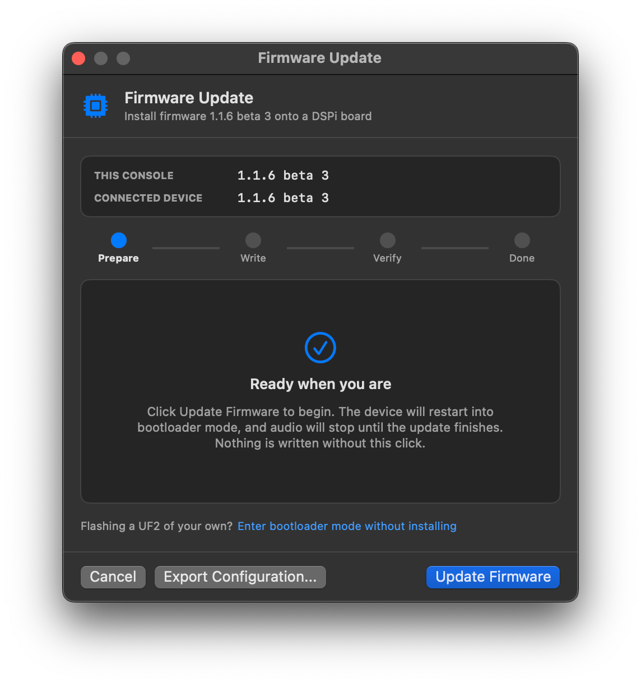

1. The window compares **THIS CONSOLE** with the **CONNECTED DEVICE**. If the device is newer, it warns that this would be a downgrade.
2. Optionally click **Export Configuration...** to save a [device configuration file](#device-configuration-files) as a backup.
3. Click **Update Firmware** (or **Downgrade**). Nothing is written until you click it. The device restarts into its bootloader, and audio stops until the update finishes.
4. The progress strip moves through **Prepare**, **Write**, **Verify** and **Done**. Near the end, the board restarts and its drive disappears. That is normal; don't unplug it.
5. Console waits for the board to come back, which can take up to half a minute, then checks the version it reports. **Update complete** confirms success.

After a success, **Update Another Board** starts again for the next board, and **Done** closes the window. After a failure, **Try Again** retries.

The first time, macOS may ask whether Console can access removable volumes. Allow it, because the board's bootloader appears as a removable drive.

### Bootloader Mode

A board with no firmware, or one that won't start, can still be updated through its bootloader. Hold the **BOOTSEL** button on the board while plugging it into your Mac. It appears as a drive called `RPI-RP2` (RP2040) or `RP2350`, and the Firmware Update window detects it within a second or so. Only connect one board in bootloader mode at a time.

To flash a firmware file of your own, click **Enter bootloader mode without installing** in the update window. The board restarts as a bootloader drive without Console writing anything. You can then copy your own `.uf2` file onto the drive.

### Firmware Update Messages

| Message | Meaning |
|---|---|
| No board in bootloader mode was found | Hold BOOTSEL while plugging the board in. |
| N boards are in bootloader mode | Disconnect all but the one you want to update. |
| The board is connected but its drive has not appeared | Allow removable-volume access if macOS asked, then try again. |
| This build of DSPi Console does not include firmware for the chip | This Console can't update that board. |
| Writing the firmware failed | Copying to the board failed; try again with a different cable or port. |
| The firmware was written but the device did not reappear | Unplug the board, plug it back in, and check whether it works. |
| The device came back running a different firmware | The update didn't take; try again. |

---

## Help Menu

| Item | What it does |
|---|---|
| **Getting Started...** | Opens the setup wizard in the main window (see [The Getting Started Wizard](#the-getting-started-wizard)). |
| **What's New in DSPi Console** | Shows the release notes. They also appear once, automatically, after Console is updated. |
| **DSPi Console on GitHub** | Opens this project's page. |
| **DSPi Firmware on GitHub** | Opens the firmware project's page. |

**DSPi Console > About DSPi Console** shows the app's version.

---

## Keyboard Shortcut Reference

**Application**

| Shortcut | Action |
|---|---|
| Cmd+, | Settings |
| Cmd+I | Import Filters |
| Cmd+E | Export Filters |
| Cmd+C / Cmd+V | Copy / paste the open channel's parameters (when no text field is active) |
| Cmd+Shift+B | AutoEQ: Browse Profiles |
| Cmd+Q | Quit (asks about unsaved changes) |

**Tool windows**

| Shortcut | Window |
|---|---|
| Cmd+Shift+M | Matrix Mixer (opens or closes) |
| Cmd+Shift+L | Loudness Compensation |
| Cmd+Shift+X | Headphone Crossfeed |
| Cmd+Shift+P | Psychoacoustic Bass |
| Cmd+Shift+S | Subharmonic Synthesizer |
| Cmd+Shift+D | Tube Modeller |
| Cmd+Shift+U | Stereo Upmixer |
| Cmd+Shift+V | Volume Leveller |
| Cmd+Shift+G | Signal Generator |
| Cmd+Shift+A | Spectrum Analyser |
| Cmd+Shift+T | System Statistics |
| Cmd+Shift+I | Interrupt Monitor |

**On the response graph** (click the graph first)

| Shortcut | Action |
|---|---|
| Delete | Delete the selected bands |
| Escape | Deselect |
| Tab / Shift-Tab | Next / previous band |
| Arrow keys | Move frequency (left and right) or gain (up and down); hold Shift for fine steps |
| Option-Up / Option-Down | Change Q |
| Cmd-A | Select all bands |

**Elsewhere**

| Shortcut | Where | Action |
|---|---|---|
| Space | Signal Generator | Start or stop |
| Return / Tab / Escape | Band chip text field | Apply / apply and move to the next field / cancel |
| Cmd + scroll | Any value field | Step the value |
| Option-click | Sidebar channel | Rename |

For every mouse gesture on the graph, see [Graph Editing Quick Reference](#graph-editing-quick-reference).

---

## Building from Source

1. Clone this repository.
2. Open `DSPi Console.xcodeproj` in Xcode.
3. Run the **DSPi Console** scheme.
4. Console connects automatically when a DSPi is detected.

The app bundles the matching firmware images from `DSPi Console/Firmware`.

## License

DSPi Console is released under the MIT License. See [LICENSE](LICENSE).
